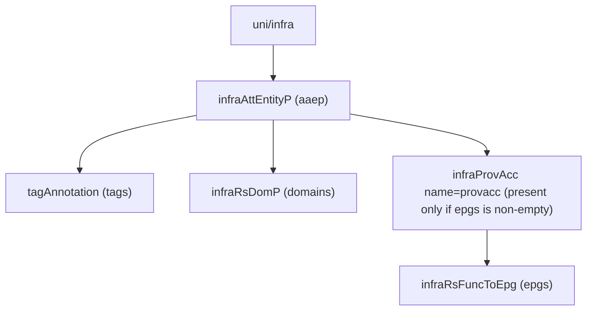

# Attachable Access Entity Profile (AAEP)

**Task file:** `roles/fabric/tasks/aaep.yml`
**Template:** `roles/fabric/templates/aaep.json.j2`
**ACI MIT class:** `infraAttEntityP`

## Description

An AAEP glues interface policy groups to domains, and optionally to specific
EPGs (static-binding-via-AAEP, useful for pre-provisioning EPG deployment on
every port the AAEP is attached to).

## Object Relationships



## Attributes

Root object: `infraAttEntityP`

| Attribute | ACI Attribute | Required | Expected Value | Default |
|---|---|---|---|---|
| `name` | `name` | Yes | string | — |
| `description` | `descr` | No | string | `''` |
| `state` | `status` | No | `present` \| `absent` | `present` (see caveat below) |
| `tags` | see [Tags](#tags) | No | array | `[]` |
| `domains` | see [Domain Bindings](#domain-bindings) | No | array | `[]` |
| `epgs` | see [EPG Bindings](#epg-bindings) | No | array | `[]` |

> **`state` default caveat:** `present` is only the default *if the task actually
> runs*. `roles/fabric/tasks/aaep.yml` gates on `aaep | has_nested_state`,
> which is `True` only when a `state` key exists *somewhere* in the AAEP's
> tree — on the AAEP itself, or on any tag, domain binding, or EPG binding. An
> AAEP with no `state` key anywhere is skipped entirely: not created, updated,
> or touched.

### Tags

Child object: `tagAnnotation`

| Attribute | ACI Attribute | Required | Expected Value | Default |
|---|---|---|---|---|
| `name` | `key` | Yes | string | — |
| `value` | `value` | Yes | string | — |
| `state` | `status` | No | `present` \| `absent` | `present` |

### Domain Bindings

Child object: `infraRsDomP`

| Attribute | ACI Attribute | Required | Expected Value | Default |
|---|---|---|---|---|
| `name` | folded into `tDn` (`uni/phys-<name>` or `uni/l3dom-<name>`) | Yes | string | — |
| `type` | selects `tDn` prefix (not a literal attribute) | Yes | `physical` \| `l3_external` | — |
| `state` | `status` | No | `present` \| `absent` | `present` |

### EPG Bindings

Wrapped in a single always-present `infraProvAcc` (name hardcoded `provacc`);
each entry is a child `infraRsFuncToEpg`.

| Attribute | ACI Attribute | Required | Expected Value | Default |
|---|---|---|---|---|
| `tenant` | folded into `tDn` (`uni/tn-<tenant>/ap-<ap>/epg-<epg>`) | Yes | string | — |
| `application_profile` | folded into `tDn` | Yes | string | — |
| `epg` | folded into `tDn` | Yes | string | — |
| `vlan` | `encap` (`vlan-<vlan>`) | Yes | integer | — |
| `mode` | `mode` | No | `regular` \| `untagged` \| `native` | `regular` |
| `deployment` | `instrImedcy` | No | `immediate` \| `lazy` | `lazy` |
| `state` | `status` | No | `present` \| `absent` | `present` |

## Examples

### Create a new AAEP

```yaml
fabric:
  aaeps:
    - name: aaep1
      state: present
      domains:
        - name: phys1
          type: physical
      epgs:
        - tenant: tenant1
          application_profile: ap1
          epg: epg1
          vlan: 100
          mode: regular
          deployment: immediate
```

### Add a domain binding to an existing AAEP

```yaml
fabric:
  aaeps:
    - name: aaep1
      domains:
        - name: l3out-dom1
          type: l3_external
          state: present
```

The new binding's `state: present` is what makes `has_nested_state` fire
this task — `aaep.state` is left unset here since it isn't changing.

### Remove a domain binding from an existing AAEP

```yaml
fabric:
  aaeps:
    - name: aaep1
      domains:
        - name: l3out-dom1
          state: absent
```

### Delete an AAEP entirely

```yaml
fabric:
  aaeps:
    - name: aaep1
      state: absent
```
