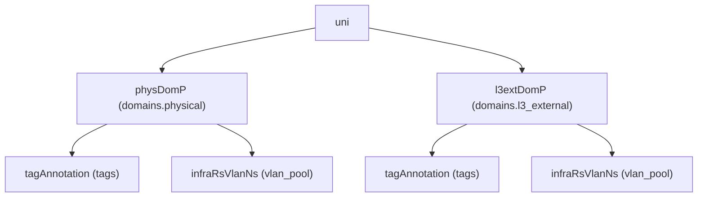

# Domain (Physical / L3 External)

**Task file:** `roles/fabric/tasks/domain.yml`
**Templates:** `roles/fabric/templates/dom_phy.json.j2`, `dom_l3ext.json.j2`
**ACI MIT classes:** `physDomP` (physical), `l3extDomP` (L3 external)

## Description

A Domain scopes where a VLAN pool can be consumed — physical domains for
bare-metal/VM server connectivity, L3-external domains for L3Out connectivity.
Both are modeled identically; the config splits them into `domains.physical`
and `domains.l3_external` buckets (no `type` discriminator field).

## Object Relationships



## Attributes

Each domain may bind **at most one** VLAN pool (`vlan_pool`), given either as a
plain string (pool name) or as an object to also pick the allocation mode.

| Attribute | ACI Attribute | Required | Expected Value | Default |
|---|---|---|---|---|
| `name` | `name` | Yes | string | — |
| `state` | `status` | No | `present` \| `absent` | `present` (see caveat below) |
| `tags` | see [Tags](#tags) | No | array | `[]` |
| `vlan_pool` | see [VLAN Pool Binding](#vlan-pool-binding) | No | string, or object | (no binding if unset) |

Note: physical/L3-external domains do **not** have a `description` field in
this ACI object — none is rendered.

> **`state` default caveat:** `present` is only the default *if the task actually
> runs*. `roles/fabric/tasks/domain.yml` gates on `dom | has_nested_state`,
> which is `True` only when a `state` key exists *somewhere* in the domain's
> tree — on the domain itself, on any tag, or on `vlan_pool` (when given as an
> object with its own `state`). A domain with no `state` key anywhere is
> skipped entirely: not created, updated, or touched.

### Tags

Child object: `tagAnnotation`

| Attribute | ACI Attribute | Required | Expected Value | Default |
|---|---|---|---|---|
| `name` | `key` | Yes | string | — |
| `value` | `value` | Yes | string | — |
| `state` | `status` | No | `present` \| `absent` | `present` |

### VLAN Pool Binding

Child object: `infraRsVlanNs`. Given either as a plain string (pool name) or
as an object to also pick the allocation mode.

| Attribute | ACI Attribute | Required | Expected Value | Default |
|---|---|---|---|---|
| `name` | folded into `tDn` (`uni/infra/vlanns-[<name>]-<allocation_mode>`) | Yes | string | — |
| `allocation_mode` | folded into `tDn` suffix | No | `static` \| `dynamic` | `static` |
| `state` | `status` | No | `present` \| `absent` | `present` |

## Examples

### Create a new Domain

```yaml
fabric:
  domains:
    physical:
      - name: phys1
        state: present
        vlan_pool: pool1
    l3_external:
      - name: l3out-dom1
        state: present
        vlan_pool:
          name: pool2
          allocation_mode: dynamic
```

### Bind a VLAN Pool to an existing Domain

`vlan_pool` is a single binding, not an array. Using the object form lets
you give the binding its own `state: present`, which is what satisfies
`has_nested_state` — the domain's own `state` doesn't need to be touched:

```yaml
fabric:
  domains:
    physical:
      - name: phys1
        vlan_pool:
          name: pool1
          state: present
```

If you use the plain-string shorthand (`vlan_pool: pool1`) instead, no
`state` key exists anywhere in the domain's tree (the string form never
carries one), so you'd also need `state: present` on the domain itself for
this task to run at all.

### Unbind a VLAN Pool from an existing Domain

```yaml
fabric:
  domains:
    physical:
      - name: phys1
        vlan_pool:
          name: pool1
          state: absent
```

This deletes just the `infraRsVlanNs` binding — the domain object itself is
left untouched (`created,modified`, since `dom.state` is unset). This
requires the object form; the plain-string shorthand has no way to express
"absent." (Also note: ACI POSTs merge into the existing tree — simply
*omitting* `vlan_pool` on a later run does **not** remove a
previously-created binding; you must explicitly mark it `state: absent`.)

### Delete a Domain entirely

```yaml
fabric:
  domains:
    physical:
      - name: phys1
        state: absent
```
