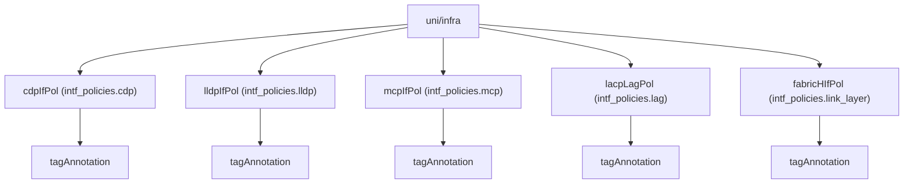

# Interface Policies (CDP / LLDP / MCP / LAG / Link Layer)

**Task file:** `roles/fabric/tasks/intf_pol.yml`
**Templates:** `intf_pol_cdp.json.j2`, `intf_pol_lldp.json.j2`, `intf_pol_mcp.json.j2`, `intf_pol_lag.json.j2`, `intf_pol_ll.json.j2`
**ACI MIT classes:** `cdpIfPol`, `lldpIfPol`, `mcpIfPol`, `lacpLagPol`, `fabricHIfPol`

## Description

Five independent interface-level policies, all configured under
`fabric.intf_policies` and all bound to an interface policy group by name
(`ipg.cdp`, `ipg.lldp`, `ipg.mcp`, `ipg.lag`, `ipg.ll` — see the
[Interface Policy Group](ipg.md) doc). Each lives directly under `uni/infra`
and is otherwise unrelated to the others.

## Object Relationships



## Attributes — CDP (`cdpIfPol`)

Root object: `cdpIfPol`

| Attribute | ACI Attribute | Required | Expected Value | Default |
|---|---|---|---|---|
| `name` | `name` | Yes | string | — |
| `admin_state` | `adminSt` | Yes | `enabled` \| `disabled` | — |
| `description` | `descr` | No | string | `''` |
| `state` | `status` | No | `present` \| `absent` | `present` (see caveat below) |
| `tags` | see [Tags](#tags) | No | array | `[]` |

## Attributes — LLDP (`lldpIfPol`)

Root object: `lldpIfPol`

| Attribute | ACI Attribute | Required | Expected Value | Default |
|---|---|---|---|---|
| `name` | `name` | Yes | string | — |
| `receive` | `adminRxSt` | Yes | `enabled` \| `disabled` | — |
| `transmit` | `adminTxSt` | Yes | `enabled` \| `disabled` | — |
| `DCBXP_version` | `portDCBXPVer` | No | `IEEE` \| `CEE` | `CEE` |
| `description` | `descr` | No | string | `''` |
| `state` | `status` | No | `present` \| `absent` | `present` (see caveat below) |
| `tags` | see [Tags](#tags) | No | array | `[]` |

## Attributes — MCP (`mcpIfPol`)

Root object: `mcpIfPol`

| Attribute | ACI Attribute | Required | Expected Value | Default |
|---|---|---|---|---|
| `name` | `name` | Yes | string | — |
| `admin_state` | `adminSt` | Yes | `enabled` \| `disabled` | — |
| `MCP_per_VLAN` | `mcpPduPerVlan` | No | `on` \| `off` | `on` |
| `mcp_mode` | `mcpMode` | No | `strict` \| `non-strict` | `non-strict` |
| `max_number_of_vlan` | `maxPduPerVlanLimit` | No | integer | `256` |
| `description` | `descr` | No | string | `''` |
| `state` | `status` | No | `present` \| `absent` | `present` (see caveat below) |
| `tags` | see [Tags](#tags) | No | array | `[]` |

## Attributes — LAG (`lacpLagPol`)

Root object: `lacpLagPol`

| Attribute | ACI Attribute | Required | Expected Value | Default |
|---|---|---|---|---|
| `name` | `name` | Yes | string | — |
| `mode` | `mode` | Yes | `active` \| `off` | — |
| `min` | `minLinks` | No | integer | `1` |
| `max` | `maxLinks` | No | integer | `16` |
| `fast_select_hot_standby_ports` | folded into `ctrl` (`fast-sel-hot-stdby`) | No | boolean | `true` |
| `graceful_convergence` | folded into `ctrl` (`graceful-conv`) | No | boolean | `true` |
| `suspend_individual_port` | folded into `ctrl` (`susp-individual`) | No | boolean | `true` |
| `symmetric_hashing` | folded into `ctrl` (`symmetric-hash`) | No | boolean | `false` |
| `description` | `descr` | No | string | `''` |
| `state` | `status` | No | `present` \| `absent` | `present` (see caveat below) |
| `tags` | see [Tags](#tags) | No | array | `[]` |

## Attributes — Link Layer (`fabricHIfPol`)

Root object: `fabricHIfPol`

| Attribute | ACI Attribute | Required | Expected Value | Default |
|---|---|---|---|---|
| `name` | `name` | Yes | string | — |
| `auto_negotiation` | `autoNeg` | Yes | boolean | — |
| `speed` | `speed` | Yes | `100M`, `1G`, `10G`, `25G`, `40G`, `400G`, `auto`, `inherit` | — |
| `description` | `descr` | No | string | `''` |
| `state` | `status` | No | `present` \| `absent` | `present` (see caveat below) |
| `tags` | see [Tags](#tags) | No | array | `[]` |

> **`state` default caveat:** `present` is only the default *if the task actually
> runs*. `roles/fabric/tasks/intf_pol.yml` gates each of the five policies on
> `pol | has_nested_state`, which is `True` only when a `state` key exists
> *somewhere* in that policy's tree — on the policy itself, or on any tag. A
> policy with no `state` key anywhere is skipped entirely: not created,
> updated, or touched. This applies identically to all five policy types
> (CDP, LLDP, MCP, LAG, Link Layer).

### Tags

Child object: `tagAnnotation` — shared shape for all five policy types above

| Attribute | ACI Attribute | Required | Expected Value | Default |
|---|---|---|---|---|
| `name` | `key` | Yes | string | — |
| `value` | `value` | Yes | string | — |
| `state` | `status` | No | `present` \| `absent` | `present` |

## Examples

### Create new policies

```yaml
fabric:
  intf_policies:
    cdp:
      - name: cdp-enabled
        admin_state: enabled
    lldp:
      - name: lldp-enabled
        receive: enabled
        transmit: enabled
    mcp:
      - name: mcp-strict
        admin_state: enabled
        mcp_mode: strict
    lag:
      - name: lacp-active
        mode: active
        symmetric_hashing: true
    link_layer:
      - name: 25g-auto
        auto_negotiation: true
        speed: 25G
```

### Add a tag to an existing policy

The same pattern applies to any of the five policy types — CDP is shown here:

```yaml
fabric:
  intf_policies:
    cdp:
      - name: cdp-enabled
        tags:
          - name: owner
            value: net-team
            state: present
```

The new tag's `state: present` is what makes `has_nested_state` fire this
task — `pol.state` is left unset here since it isn't changing.

### Remove a tag from an existing policy

```yaml
fabric:
  intf_policies:
    cdp:
      - name: cdp-enabled
        tags:
          - name: owner
            state: absent
```

### Delete a policy entirely

```yaml
fabric:
  intf_policies:
    cdp:
      - name: cdp-enabled
        state: absent
```
