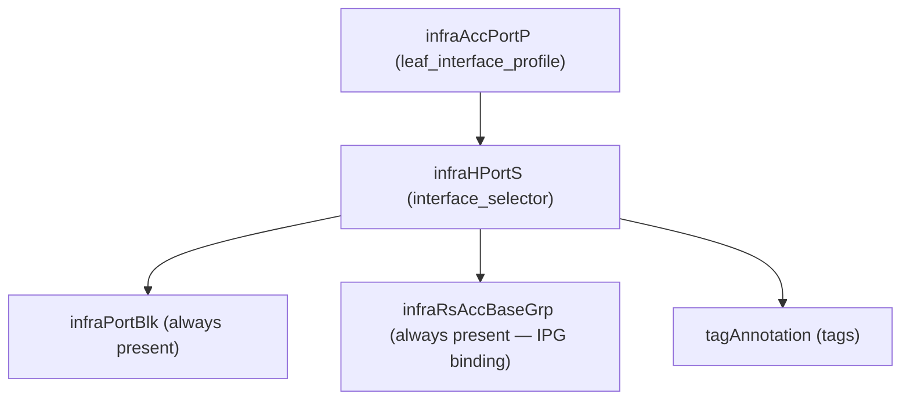

# Interface Selector

**Task file:** `roles/fabric/tasks/intf_selector.yml`
**Template:** `roles/fabric/templates/intf_selector.json.j2`
**ACI MIT class:** `infraHPortS`

## Description

An Interface Selector picks a physical port (or a card/port range) under a
Leaf Interface Profile and binds it to an Interface Policy Group. Configured
under each [Leaf Interface Profile](leaf_intf_prof.md)'s `interface_selectors`
list, flattened with Ansible's `subelements` so each selector can be
created/deleted independently of its parent profile.

This template is an intentional copy of the node role's per-node interface
selector — see [Node: Interface Selector](../node/intf.md). The only
difference is what feeds `ipg_type` (`accportgrp`/`accbundle`): here it comes
from the same `ipg_to_type_map` fact built once in `iac.yml` from
`interface_policy_groups`.

## Object Relationships



## Attributes

Root object: `infraHPortS`

| Attribute | ACI Attribute | Required | Expected Value | Default |
|---|---|---|---|---|
| `card` | child `infraPortBlk.fromCard`/`toCard` | Yes | integer | — |
| `intf_pol_group` | child `infraRsAccBaseGrp.tDn` (`uni/infra/funcprof/<accportgrp\|accbundle>-<ipg>`) | Yes | string — references an [Interface Policy Group](ipg.md) | — |
| `port` | child `infraPortBlk.fromPort`/`toPort` | No | integer — single port | — |
| `from_port` | child `infraPortBlk.fromPort` | No | integer — port range start; falls back to `port` if unset | `port` |
| `to_port` | child `infraPortBlk.toPort` | No | integer — port range end; falls back to `port` if unset | `port` |
| `selector_name` | `infraHPortS.name` | No | string — overrides the `infraHPortS` name | `eth{card}_{port}` or `eth{card}_{from}-{to}` |
| `selector_description` | `infraHPortS.descr` | No | string | `''` |
| `port_block_name` | child `infraPortBlk.name` | No | string — overrides the `infraPortBlk` name | `block2` |
| `port_block_description` | child `infraPortBlk.descr` | No | string | `''` |
| `state` | `infraHPortS.status` | No | `present` \| `absent` | `present` (see caveat below) |
| `tags` | see [Tags](#tags) | No | array | `[]` |

> **`state` default caveat:** `present` is only the default *if the task actually
> runs*. `roles/fabric/tasks/intf_selector.yml` gates on **two** conditions:
> `intf | has_nested_state` (a `state` key exists somewhere in the selector's
> own tree — on the selector itself, or on any tag), **and** the parent Leaf
> Interface Profile is not itself absent (`leaf_intf_prof.state` is undefined
> or not `absent`). A selector with `state` nowhere in its tree is skipped
> entirely. And even a selector that does have a nested state is skipped if
> its parent profile is being deleted (`leaf_intf_prof.state: absent`) —
> deleting the profile takes the selector with it.

### Tags

Child object: `tagAnnotation`

| Attribute | ACI Attribute | Required | Expected Value | Default |
|---|---|---|---|---|
| `name` | `key` | Yes | string | — |
| `value` | `value` | Yes | string | — |
| `state` | `status` | No | `present` \| `absent` | `present` |

## Examples

### Create new Interface Selectors

```yaml
fabric:
  leaf_interface_profiles:
    - name: leaf_601_602_intf_prof
      interface_selectors:
        - port: 1
          card: 1
          intf_pol_group: server1
        - from_port: 4
          to_port: 6
          card: 1
          intf_pol_group: server3
          selector_name: my-selector
          port_block_name: my_block
```

### Add a tag to an existing Interface Selector

```yaml
fabric:
  leaf_interface_profiles:
    - name: leaf_601_602_intf_prof
      interface_selectors:
        - port: 1
          card: 1
          tags:
            - name: owner
              value: infra-team
              state: present
```

The new tag's `state: present` is what makes `has_nested_state` fire this
task — the selector's own `state` is left unset here since it isn't
changing. This also requires the parent Leaf Interface Profile to not
itself be `absent` (see caveat above).

### Remove a tag from an existing Interface Selector

```yaml
fabric:
  leaf_interface_profiles:
    - name: leaf_601_602_intf_prof
      interface_selectors:
        - port: 1
          card: 1
          tags:
            - name: owner
              state: absent
```

### Delete an Interface Selector entirely

```yaml
fabric:
  leaf_interface_profiles:
    - name: leaf_601_602_intf_prof
      interface_selectors:
        - port: 1
          card: 1
          state: absent
```
