# Interface Policy Group (Access / Port-Channel / vPC)

**Task file:** `roles/fabric/tasks/ipg.yml`
**Templates:** `roles/fabric/templates/ipg_access.json.j2`, `ipg_po.json.j2`
**ACI MIT classes:** `infraAccPortGrp` (access), `infraAccBndlGrp` (port-channel / vPC)

## Description

An Interface Policy Group (IPG) bundles the per-interface policies (STP, MCP,
CDP, LLDP, L2, link-layer, and — for port-channel/vPC — LACP) plus an AAEP
binding, applied to a physical port (access) or a bundle of ports
(port-channel/vPC). Configured under `fabric.interface_policy_groups`, split
into `access`, `port-channel`, and `vpc` buckets — the bucket determines both
the MO class and, for bundles, the `lagT` (`link` for port-channel, `node` for
vPC).

## Object Relationships

```mermaid
graph TD
  infra["uni/infra/funcprof"] --> access["infraAccPortGrp (access)"]
  infra --> bundle["infraAccBndlGrp (port-channel / vpc)"]
  access --> stp["infraRsStpIfPol"]
  access --> mcp["infraRsMcpIfPol"]
  access --> att["infraRsAttEntP (aaep)"]
  access --> cdp["infraRsCdpIfPol"]
  access --> lldp["infraRsLldpIfPol"]
  access --> l2["infraRsL2IfPol"]
  access --> hif["infraRsHIfPol (ll)"]
  access --> tag1["tagAnnotation (tags)"]
  bundle --> bstp["infraRsStpIfPol"]
  bundle --> bmcp["infraRsMcpIfPol"]
  bundle --> batt["infraRsAttEntP (aaep)"]
  bundle --> bcdp["infraRsCdpIfPol"]
  bundle --> blldp["infraRsLldpIfPol"]
  bundle --> bl2["infraRsL2IfPol"]
  bundle --> bhif["infraRsHIfPol (ll)"]
  bundle --> lacp["infraRsLacpPol (lag)"]
  bundle --> tag2["tagAnnotation (tags)"]
```



## Attributes

Root object: `infraAccPortGrp` (access) / `infraAccBndlGrp` (port-channel, vPC)

| Attribute | ACI Attribute | Required | Expected Value | Default | Access | Port-Channel/vPC |
|---|---|---|---|---|---|---|
| `name` | `name` | Yes | string | — | ✓ | ✓ |
| `description` | `descr` | No | string | `''` | ✓ | ✓ |
| `state` | `status` | No | `present` \| `absent` | `present` (see caveat below) | ✓ | ✓ |
| `stp` | child `infraRsStpIfPol.tnStpIfPolName` | No | string — STP policy name | `''` | ✓ | ✓ |
| `mcp` | child `infraRsMcpIfPol.tnMcpIfPolName` | No | string — MCP policy name | `''` | ✓ | ✓ |
| `cdp` | child `infraRsCdpIfPol.tnCdpIfPolName` | No | string — CDP policy name | `''` | ✓ | ✓ |
| `lldp` | child `infraRsLldpIfPol.tnLldpIfPolName` | No | string — LLDP policy name | `''` | ✓ | ✓ |
| `l2` | child `infraRsL2IfPol.tnL2IfPolName` | No | string — L2 interface policy name | `''` | ✓ | ✓ |
| `ll` | child `infraRsHIfPol.tnFabricHIfPolName` | No | string — Link Layer policy name | `''` | ✓ | ✓ |
| `aaep` | child `infraRsAttEntP.tDn` (`uni/infra/attentp-<aaep>`) | No | string — AAEP name | (empty `tDn` if unset) | ✓ | ✓ |
| `lag` | child `infraRsLacpPol.tnLacpLagPolName` | No | string — LACP policy name | `''` | — | ✓ only |
| `tags` | see [Tags](#tags) | No | array | `[]` | ✓ | ✓ |

`lagT` is not user-configurable — it's hardcoded per bucket (`link` for
`port-channel`, `node` for `vpc`).

> **`state` default caveat:** `present` is only the default *if the task actually
> runs*. `roles/fabric/tasks/ipg.yml` gates each of the three buckets (access,
> port-channel, vpc) on `ipg | has_nested_state`, which is `True` only when a
> `state` key exists *somewhere* in that IPG's tree — on the IPG itself, or on
> any tag. An IPG with no `state` key anywhere is skipped entirely: not
> created, updated, or touched.

### Tags

Child object: `tagAnnotation`

| Attribute | ACI Attribute | Required | Expected Value | Default |
|---|---|---|---|---|
| `name` | `key` | Yes | string | — |
| `value` | `value` | Yes | string | — |
| `state` | `status` | No | `present` \| `absent` | `present` |

## Examples

### Create new IPGs

```yaml
fabric:
  interface_policy_groups:
    access:
      - name: server1
        cdp: cdp-enabled
        lldp: lldp-enabled
        aaep: aaep1
    port-channel:
      - name: po-server2
        lag: lacp-active
        aaep: aaep1
    vpc:
      - name: vpc-server3
        lag: lacp-active
        aaep: aaep1
```

### Add a tag to an existing IPG

The same pattern applies to any of the three buckets — access is shown here:

```yaml
fabric:
  interface_policy_groups:
    access:
      - name: server1
        tags:
          - name: owner
            value: infra-team
            state: present
```

The new tag's `state: present` is what makes `has_nested_state` fire this
task — `ipg.state` is left unset here since it isn't changing.

### Remove a tag from an existing IPG

```yaml
fabric:
  interface_policy_groups:
    access:
      - name: server1
        tags:
          - name: owner
            state: absent
```

### Delete an IPG entirely

```yaml
fabric:
  interface_policy_groups:
    access:
      - name: server1
        state: absent
```
