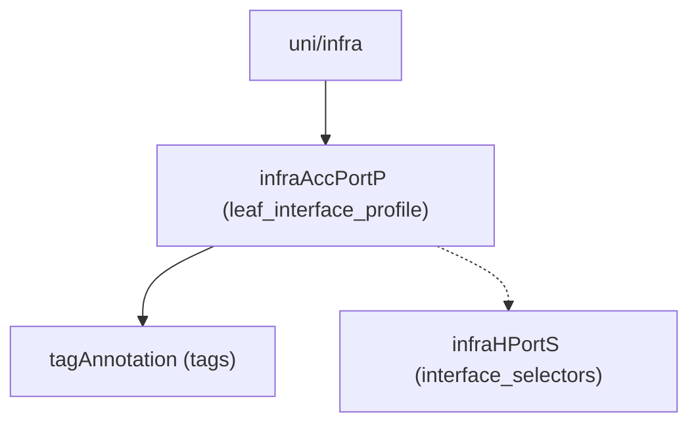

# Leaf Interface Profile

**Task file:** `roles/fabric/tasks/leaf_intf_prof.yml`
**Template:** `roles/fabric/templates/leaf_intf_prof.json.j2`
**ACI MIT class:** `infraAccPortP`

## Description

A Leaf Interface Profile is the container that port selectors
(`interface_selectors`) live under. It's bound to one or more
[Leaf Profiles](leaf_prof.md) to apply its selectors to specific switches.

## Object Relationships



The dashed edge (`interface_selectors`) is rendered by a separate task/API
call — see [Interface Selector](intf_selector.md) — not by this template.

## Attributes

Root object: `infraAccPortP`

| Attribute | ACI Attribute | Required | Expected Value | Default |
|---|---|---|---|---|
| `name` | `name` | Yes | string | — |
| `description` | `descr` | No | string | `''` |
| `state` | `status` | No | `present` \| `absent` | `present` (see caveat below) |
| `tags` | see [Tags](#tags) | No | array | `[]` |
| `interface_selectors` | not rendered here — see [Interface Selector](intf_selector.md) | No | array — see [Interface Selector](intf_selector.md) | `[]` |

> **`state` default caveat:** `present` is only the default *if the task actually
> runs*. `roles/fabric/tasks/leaf_intf_prof.yml` gates on
> `leaf_intf_prof | has_nested_state` with **no** `include_keys`/`exclude_keys`
> restriction, so it recurses into every nested field — including
> `interface_selectors`, even though this template never renders them (they're
> handled by the separate [Interface Selector](intf_selector.md) task). That
> means a leaf interface profile with no `state` on itself or its tags, but
> with one interface selector carrying `state: absent`, still causes *this*
> task to run too — a harmless no-op call, since the template only ever
> renders `name`/`descr`/`tags`. A profile with no `state` key anywhere at
> all (including inside its selectors) is skipped entirely.

### Tags

Child object: `tagAnnotation`

| Attribute | ACI Attribute | Required | Expected Value | Default |
|---|---|---|---|---|
| `name` | `key` | Yes | string | — |
| `value` | `value` | Yes | string | — |
| `state` | `status` | No | `present` \| `absent` | `present` |

## Examples

### Create a new Leaf Interface Profile

```yaml
fabric:
  leaf_interface_profiles:
    - name: leaf_601_602_intf_prof
      state: present
      interface_selectors:
        - port: 1
          card: 1
          intf_pol_group: server1
```

### Add a tag to an existing Leaf Interface Profile

```yaml
fabric:
  leaf_interface_profiles:
    - name: leaf_601_602_intf_prof
      tags:
        - name: owner
          value: infra-team
          state: present
```

The new tag's `state: present` is what makes `has_nested_state` fire this
task — `leaf_intf_prof.state` is left unset here since it isn't changing.
(To add or remove an interface selector instead, see
[Interface Selector](intf_selector.md) — that's a separate task/doc.)

### Remove a tag from an existing Leaf Interface Profile

```yaml
fabric:
  leaf_interface_profiles:
    - name: leaf_601_602_intf_prof
      tags:
        - name: owner
          state: absent
```

### Delete a Leaf Interface Profile entirely

```yaml
fabric:
  leaf_interface_profiles:
    - name: leaf_601_602_intf_prof
      state: absent
```
