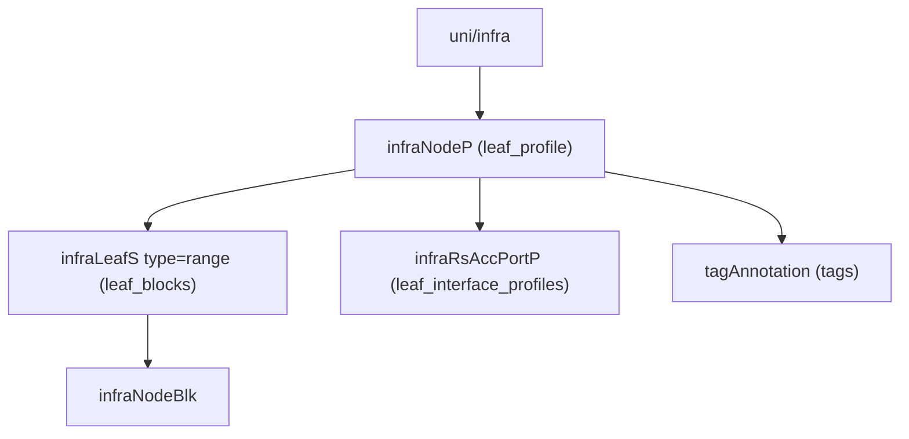

# Leaf Profile

**Task file:** `roles/fabric/tasks/leaf_prof.yml`
**Template:** `roles/fabric/templates/leaf_prof.json.j2`
**ACI MIT class:** `infraNodeP`

## Description

A Leaf Profile selects which switches (via node-ID block ranges) a given set of
Leaf Interface Profiles should be applied to.

## Object Relationships



## Attributes

Root object: `infraNodeP`

| Attribute | ACI Attribute | Required | Expected Value | Default |
|---|---|---|---|---|
| `name` | `name` | Yes | string | — |
| `description` | `descr` | No | string | `''` |
| `state` | `status` | No | `present` \| `absent` | `present` (see caveat below) |
| `tags` | see [Tags](#tags) | No | array | `[]` |
| `leaf_blocks` | see [Leaf Blocks](#leaf-blocks) | No | array | `[]` |
| `leaf_interface_profiles` | see [Leaf Interface Profile Bindings](#leaf-interface-profile-bindings) | No | array | `[]` |

> **`state` default caveat:** `present` is only the default *if the task actually
> runs*. `roles/fabric/tasks/leaf_prof.yml` gates on
> `leaf_prof | has_nested_state`, which is `True` only when a `state` key
> exists *somewhere* in the leaf profile's tree — on the profile itself, or on
> any tag, leaf block, or leaf interface profile binding. A leaf profile with
> no `state` key anywhere is skipped entirely: not created, updated, or
> touched.

### Tags

Child object: `tagAnnotation`

| Attribute | ACI Attribute | Required | Expected Value | Default |
|---|---|---|---|---|
| `name` | `key` | Yes | string | — |
| `value` | `value` | Yes | string | — |
| `state` | `status` | No | `present` \| `absent` | `present` |

### Leaf Blocks

Child object: `infraLeafS` (with a nested `infraNodeBlk`)

| Attribute | ACI Attribute | Required | Expected Value | Default |
|---|---|---|---|---|
| `name` | `infraLeafS.name` / `infraNodeBlk.name` | No | string | — |
| `from_` | grandchild `infraNodeBlk.from_` | Yes | integer, node ID | — |
| `to_` | grandchild `infraNodeBlk.to_` | Yes | integer, node ID | — |
| `state` | `infraLeafS.status` / grandchild `infraNodeBlk.status` | No | `present` \| `absent` | `present` |

### Leaf Interface Profile Bindings

Child object: `infraRsAccPortP`

| Attribute | ACI Attribute | Required | Expected Value | Default |
|---|---|---|---|---|
| `name` | `tDn` (`uni/infra/accportprof-<name>`) | Yes | string — references a [Leaf Interface Profile](leaf_intf_prof.md) | — |
| `state` | `status` | No | `present` \| `absent` | `present` |

## Examples

### Create a new Leaf Profile

```yaml
fabric:
  leaf_profiles:
    - name: leaf_601_602_prof
      state: present
      leaf_blocks:
        - name: block1
          from_: 601
          to_: 602
      leaf_interface_profiles:
        - name: leaf_601_602_intf_prof
```

### Add a leaf block to an existing Leaf Profile

```yaml
fabric:
  leaf_profiles:
    - name: leaf_601_602_prof
      leaf_blocks:
        - name: block2
          from_: 603
          to_: 604
          state: present
```

The new block's `state: present` is what makes `has_nested_state` fire this
task — `leaf_prof.state` is left unset here since it isn't changing.

### Remove a leaf block from an existing Leaf Profile

```yaml
fabric:
  leaf_profiles:
    - name: leaf_601_602_prof
      leaf_blocks:
        - name: block2
          state: absent
```

### Delete a Leaf Profile entirely

```yaml
fabric:
  leaf_profiles:
    - name: leaf_601_602_prof
      state: absent
```
