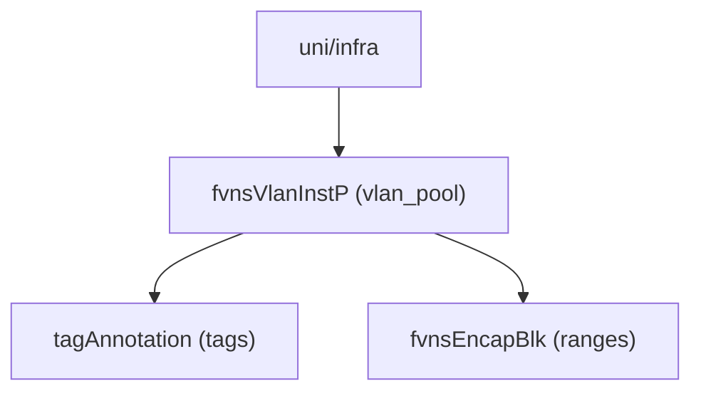

# VLAN Pool

**Task file:** `roles/fabric/tasks/vlan_pool.yml`
**Template:** `roles/fabric/templates/vlan_pool.json.j2`
**ACI MIT class:** `fvnsVlanInstP`

## Description

A VLAN Pool is a named set of VLAN (or range of VLAN) encapsulation blocks that
domains (physical/L3-external) draw from when binding to an AAEP/interface
policy group. It lives directly under the infra tenant (`uni/infra`).

## Object Relationships



## Attributes

Root object: `fvnsVlanInstP`

| Attribute | ACI Attribute | Required | Expected Value | Default |
|---|---|---|---|---|
| `name` | `name` | Yes | string | — |
| `description` | `descr` | No | string | `''` |
| `allocation_mode` | `allocMode` | No | `static` \| `dynamic` | `dynamic` |
| `state` | `status` | No | `present` \| `absent` | `present` (see caveat below) |
| `tags` | see [Tags](#tags) | No | array | `[]` |
| `ranges` | see [Ranges](#ranges) | No | array | `[]` |

> **`state` default caveat:** `present` is only the default *if the task actually
> runs*. `roles/fabric/tasks/vlan_pool.yml` gates on `pool | has_nested_state`,
> which is `True` only when a `state` key exists *somewhere* in the pool's
> tree — on the pool itself, or on any tag or range. A VLAN pool with no
> `state` key anywhere is skipped entirely: not created, updated, or touched.

### Tags

Child object: `tagAnnotation`

| Attribute | ACI Attribute | Required | Expected Value | Default |
|---|---|---|---|---|
| `name` | `key` | Yes | string | — |
| `value` | `value` | Yes | string | — |
| `state` | `status` | No | `present` \| `absent` | `present` |

### Ranges

Child object: `fvnsEncapBlk`

| Attribute | ACI Attribute | Required | Expected Value | Default |
|---|---|---|---|---|
| `from_` | `from` (`vlan-<id>`) | Yes | integer, VLAN ID | — |
| `to_` | `to` (`vlan-<id>`) | Yes | integer, VLAN ID | — |
| `description` | `descr` | No | string | `''` |
| `role` | `role` | No | `external` \| `internal` | `external` |
| `allocation_mode` | `allocMode` | No | `inherit` \| `static` \| `dynamic` | `inherit` |
| `state` | `status` | No | `present` \| `absent` | `present` |

## Examples

### Create a new VLAN Pool

```yaml
fabric:
  vlan_pools:
    - name: pool1
      allocation_mode: static
      state: present
      ranges:
        - from_: 100
          to_: 200
          allocation_mode: static
```

### Add a range to an existing VLAN Pool

```yaml
fabric:
  vlan_pools:
    - name: pool1
      ranges:
        - from_: 300
          to_: 400
          state: present
```

The new range's `state: present` is what makes `has_nested_state` fire this
task — `pool.state` is left unset here since it isn't changing.

### Remove a range from an existing VLAN Pool

```yaml
fabric:
  vlan_pools:
    - name: pool1
      ranges:
        - from_: 300
          to_: 400
          state: absent
```

### Delete a VLAN Pool entirely

```yaml
fabric:
  vlan_pools:
    - name: pool1
      state: absent
```
