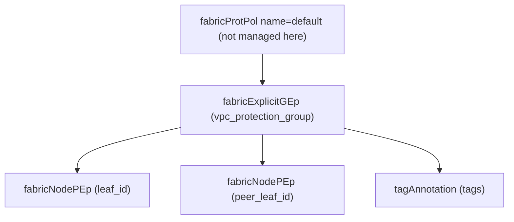

# VPC Protection Group

**Task file:** `roles/fabric/tasks/vpc_domain.yml`
**Template:** `roles/fabric/templates/vpc_domain.json.j2`
**ACI MIT class:** `fabricExplicitGEp`

## Description

A VPC Protection Group (explicit VPC domain) pairs two leaf switches together
so they can form vPCs. It's posted as a child of the fabric's single
`fabricProtPol` singleton (`uni/fabric/protpol`, name `default`), which is not
itself managed by this role — APIC creates it by default.

## Object Relationships



## Attributes

Root object: `fabricExplicitGEp`

| Attribute | ACI Attribute | Required | Expected Value | Default |
|---|---|---|---|---|
| `name` | `name` | Yes | string | — |
| `group_id` | `id` | Yes | integer — the VPC domain ID | — |
| `pod_id` | child `fabricNodePEp.podId` (both members) | Yes | integer | — |
| `leaf_id` | child `fabricNodePEp.id` (1st member) | Yes | integer | — |
| `peer_leaf_id` | child `fabricNodePEp.id` (2nd member) | Yes | integer | — |
| `description` | not rendered by the template (see note below) | No | string | (no effect) |
| `state` | `status` | No | `present` \| `absent` | `present` (see caveat below) |
| `tags` | see [Tags](#tags) | No | array | `[]` |

> Note: `description` is currently declared in `schema.json` but not rendered
> by the template — setting it has no effect yet.

> **`state` default caveat:** `present` is only the default *if the task actually
> runs*. `roles/fabric/tasks/vpc_domain.yml` gates on
> `vpc_grp | has_nested_state`, which is `True` only when a `state` key exists
> *somewhere* in the group's tree — on the group itself, or on any tag. A VPC
> protection group with no `state` key anywhere is skipped entirely: not
> created, updated, or touched.

### Tags

Child object: `tagAnnotation`

| Attribute | ACI Attribute | Required | Expected Value | Default |
|---|---|---|---|---|
| `name` | `key` | Yes | string | — |
| `value` | `value` | Yes | string | — |
| `state` | `status` | No | `present` \| `absent` | `present` |

## Examples

### Create a new VPC Protection Group

```yaml
fabric:
  vpc_protection_groups:
    - name: lf601.602.p01.vpcdom
      group_id: 1
      pod_id: 1
      leaf_id: 601
      peer_leaf_id: 602
      state: present
```

### Add a tag to an existing VPC Protection Group

```yaml
fabric:
  vpc_protection_groups:
    - name: lf601.602.p01.vpcdom
      tags:
        - name: owner
          value: infra-team
          state: present
```

The new tag's `state: present` is what makes `has_nested_state` fire this
task — `vpc_grp.state` is left unset here since it isn't changing.

### Remove a tag from an existing VPC Protection Group

```yaml
fabric:
  vpc_protection_groups:
    - name: lf601.602.p01.vpcdom
      tags:
        - name: owner
          state: absent
```

### Delete a VPC Protection Group entirely

```yaml
fabric:
  vpc_protection_groups:
    - name: lf601.602.p01.vpcdom
      state: absent
```
