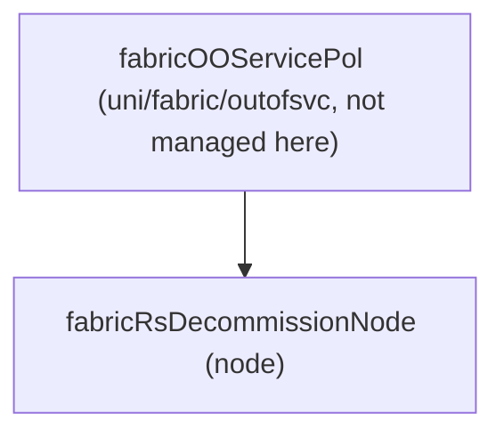

# Node Decommission

**Task file:** `roles/node/tasks/decommission.yml`
**Template:** `roles/node/templates/decommission.json.j2`
**ACI MIT class:** `fabricRsDecommissionNode`

## Description

Triggers APIC's decommission-and-remove workflow for a node. Posted as a child
of the fabric's out-of-service policy singleton (`uni/fabric/outofsvc`), which
is not itself managed by this role. This task only runs
`when: node.state == 'absent'` — the complementary condition to
[Node Registration](register.md)'s present-only check, so exactly one of the
two tasks fires per node.

## Object Relationships



No children.

## Attributes

Root object: `fabricRsDecommissionNode`

| Attribute | ACI Attribute | Required | Expected Value | Default |
|---|---|---|---|---|
| `pod_id` | folded into `tDn` (`topology/pod-<pod_id>/node-<leaf_id>`) | Yes | integer | — |
| `leaf_id` | folded into `tDn` | Yes | integer | — |
| `state` | not rendered — gates whether the task runs at all | No | `present` \| `absent` — task only fires on `absent` | — |

`tDn` is built as `topology/pod-{pod_id}/node-{leaf_id}`. `removeFromController`
is always `"true"`, and `status` is always `created,modified` — posting this
relationship object (with `removeFromController: true`) *is* the decommission
action, it doesn't mean the node itself is being created.

## Example

```yaml
nodes:
  - name: leaf601
    type: leaf
    leaf_id: 601
    pod_id: 1
    sn: "tep-1-601"
    role: leaf
    state: absent
```
