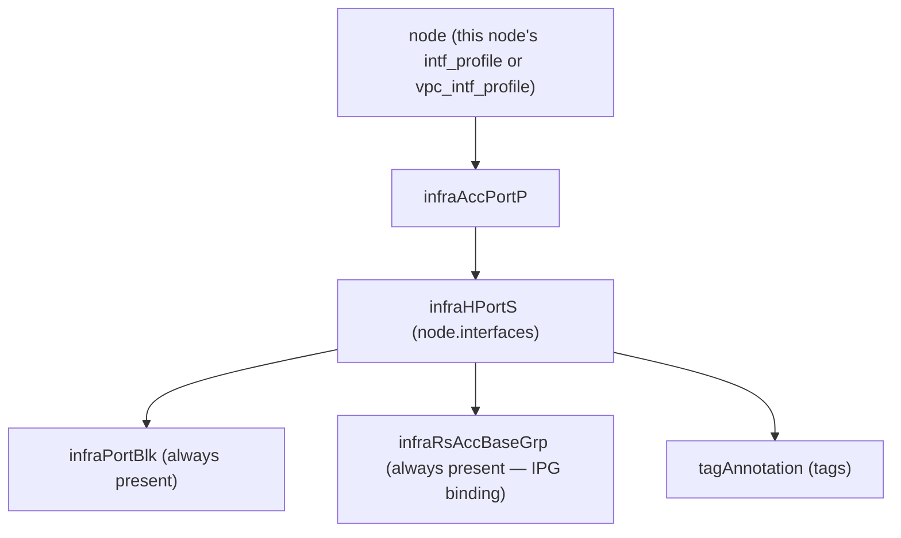

# Interface Selector (per-node)

**Task file:** `roles/node/tasks/intf.yml`
**Template:** `roles/node/templates/intf_selector.json.j2`
**ACI MIT class:** `infraHPortS`

## Description

Same object as the fabric role's [Interface Selector](../fabric/intf_selector.md)
— the two templates are intentional copies of each other (see the sync-note
comment in both files) — but applied per-node under `node.interfaces` instead
of under a shared Leaf Interface Profile. The target profile is picked
dynamically: `node.vpc_intf_profile` if the referenced Interface Policy Group's
`lag_type` is `vpc` (from `ipg_to_type_map`, built once in `iac.yml`),
otherwise `node.intf_profile`.

## Object Relationships



## Attributes

Root object: `infraHPortS`

| Attribute | ACI Attribute | Required | Expected Value | Default |
|---|---|---|---|---|
| `card` | child `infraPortBlk.fromCard`/`toCard` | Yes | integer | — |
| `intf_pol_group` | child `infraRsAccBaseGrp.tDn` (`uni/infra/funcprof/<accportgrp\|accbundle>-<ipg>`) | Yes | string — references a fabric [Interface Policy Group](../fabric/ipg.md) | — |
| `port` | child `infraPortBlk.fromPort`/`toPort` | No | integer — single port | — |
| `from_port` | child `infraPortBlk.fromPort` | No | integer — port range start; falls back to `port` if unset | `port` |
| `to_port` | child `infraPortBlk.toPort` | No | integer — port range end; falls back to `port` if unset | `port` |
| `selector_name` | `infraHPortS.name` | No | string — overrides the `infraHPortS` name | `eth{card}_{port}` or `eth{card}_{from}-{to}` |
| `selector_description` | `infraHPortS.descr` | No | string | `''` |
| `port_block_name` | child `infraPortBlk.name` | No | string — overrides the `infraPortBlk` name | `block2` |
| `port_block_description` | child `infraPortBlk.descr` | No | string | `''` |
| `state` | `infraHPortS.status` | No | `present` \| `absent` | `present` (see caveat below) |
| `tags` | see [Tags](#tags) | No | array | `[]` |

> **`state` default caveat:** `present` is only the default *if the task actually
> runs*. `roles/node/tasks/intf.yml` gates on `intf | has_nested_state`, which
> is `True` only when a `state` key exists *somewhere* in the interface's own
> tree — on the interface itself, or on any tag. An interface with no `state`
> key anywhere is skipped entirely: not created, updated, or touched. Unlike
> the fabric role's [Interface Selector](../fabric/intf_selector.md), this
> task has no parent-state gate of its own — a node's `state` is handled by
> separate [Node Registration](register.md)/[Node Decommission](decommission.md)
> tasks, not by gating this one.

### Tags

Child object: `tagAnnotation`

| Attribute | ACI Attribute | Required | Expected Value | Default |
|---|---|---|---|---|
| `name` | `key` | Yes | string | — |
| `value` | `value` | Yes | string | — |
| `state` | `status` | No | `present` \| `absent` | `present` |

## Examples

### Create new interfaces on a node

```yaml
nodes:
  - name: leaf601
    type: leaf
    leaf_id: 601
    pod_id: 1
    sn: "tep-1-601"
    role: leaf
    intf_profile: leaf_601_intf_prof
    interfaces:
      - port: 1
        card: 1
        intf_pol_group: server1
      - from_port: 4
        to_port: 6
        card: 1
        intf_pol_group: server3
```

### Add a tag to an existing interface

```yaml
nodes:
  - name: leaf601
    intf_profile: leaf_601_intf_prof
    interfaces:
      - port: 1
        card: 1
        tags:
          - name: owner
            value: infra-team
            state: present
```

The new tag's `state: present` is what makes `has_nested_state` fire this
task — the interface's own `state` is left unset here since it isn't changing.

### Remove a tag from an existing interface

```yaml
nodes:
  - name: leaf601
    intf_profile: leaf_601_intf_prof
    interfaces:
      - port: 1
        card: 1
        tags:
          - name: owner
            state: absent
```

### Delete an interface entirely

```yaml
nodes:
  - name: leaf601
    intf_profile: leaf_601_intf_prof
    interfaces:
      - port: 1
        card: 1
        state: absent
```
