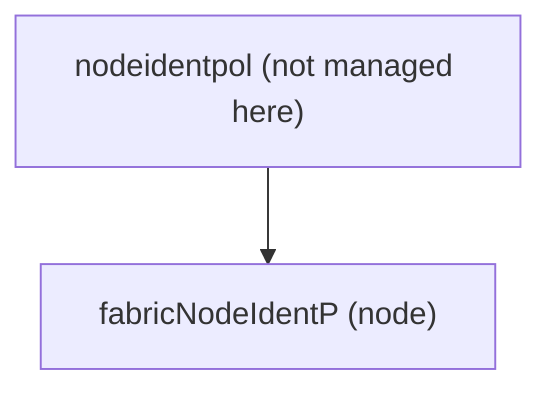

# Node Registration

**Task file:** `roles/node/tasks/register.yml`
**Template:** `roles/node/templates/register.json.j2`
**ACI MIT class:** `fabricNodeIdentP`

## Description

Registers a switch's serial number against a node ID/pod, so APIC will admit
it into the fabric under that identity. Posted as a child of the fabric's
`nodeidentpol` singleton (`uni/controller/nodeidentpol`), which is not itself
managed by this role. This task only runs `when: node.state == 'present'` —
there is no delete path (see [Node Decommission](decommission.md) for
removing a node).

## Object Relationships



No children — this is a leaf object in the current implementation.

## Attributes

Root object: `fabricNodeIdentP`

| Attribute | ACI Attribute | Required | Expected Value | Default |
|---|---|---|---|---|
| `name` | `name` | Yes | string | — |
| `sn` | `serial` | Yes | string — chassis serial number | — |
| `leaf_id` | `nodeId` | Yes | integer — node ID | — |
| `pod_id` | `podId` | Yes | integer | — |
| `role` | `role` | Yes | `leaf` \| `spine` \| `remote-leaf-wan` | — |
| `extended_pool_id` | `extPoolId` | Conditional (when `role: remote-leaf-wan`) | integer | — |
| `state` | not rendered — gates whether the task runs at all | No | `present` \| `absent` — task only fires on `present` | — |

When `role` is `remote-leaf-wan`, the rendered `role` attribute is `leaf` and
`nodeType`/`extPoolId` are added; for `leaf`/`spine` the `role` attribute
passes straight through.

## Example

```yaml
nodes:
  - name: leaf601
    type: leaf
    leaf_id: 601
    pod_id: 1
    sn: "tep-1-601"
    role: leaf
    state: present
```

```yaml
nodes:
  - name: rleaf701
    type: leaf
    leaf_id: 701
    pod_id: 2
    sn: "tep-2-701"
    role: remote-leaf-wan
    extended_pool_id: 5
    state: present
```
