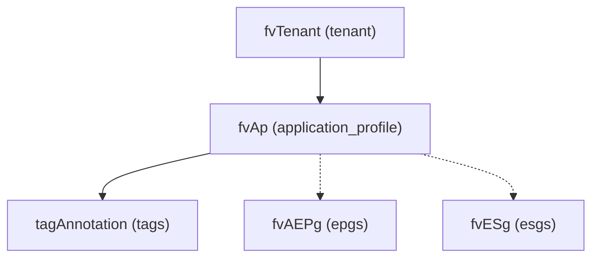

# Application Profile

**Task file:** `roles/tenant/tasks/ap.yml`
**Template:** `roles/tenant/templates/ap.json.j2`
**ACI MIT class:** `fvAp`

## Description

An Application Profile groups a set of related EPGs/ESGs that together implement an
application's connectivity requirements. It lives directly under a tenant.

## Object Relationships



Dashed edges (`epgs`/`esgs`) are managed by their own separate tasks/docs.

## Attributes

Root object: `fvAp`

| Attribute | ACI Attribute | Required | Expected Value | Default |
|---|---|---|---|---|
| `name` | `name` | Yes | string | — |
| `description` | `descr` | No | string | `''` |
| `state` | `status` | No | `present` \| `absent` | `present` (see caveat below) |
| `tags` | see [Tags](#tags) | No | array | `[]` |

> **`state` default caveat:** `present` is only the default *if the task actually
> runs*. `roles/tenant/tasks/ap.yml` gates on
> `ap | has_nested_state(include_keys=['tags'])` — note the `include_keys`
> restriction: only a `state` key on the AP itself or inside `tags` causes the
> task to run. A `state` set inside `epgs` or `esgs` does **not** count here
> (those are handled by their own separate tasks/docs with their own gating).
> An AP with `state` nowhere on itself or its tags is skipped entirely — even
> if one of its EPGs carries `state: absent` — only that EPG's own task runs.

### Tags

Child object: `tagAnnotation`

| Attribute | ACI Attribute | Required | Expected Value | Default |
|---|---|---|---|---|
| `name` | `key` | Yes | string | — |
| `value` | `value` | Yes | string | — |
| `state` | `status` | No | `present` \| `absent` | `present` |

## Examples

### Create a new Application Profile

```yaml
tenants:
  - name: tenant1
    application_profiles:
      - name: ap1
        description: "Web tier application"
        state: present
        tags:
          - name: env
            value: prod
```

### Add a tag to an existing Application Profile

```yaml
tenants:
  - name: tenant1
    application_profiles:
      - name: ap1
        tags:
          - name: owner
            value: web-team
            state: present
```

The new tag's `state: present` is what makes `has_nested_state(include_keys=['tags'])`
fire this task — `ap.state` is left unset here since it isn't changing.

### Remove a tag from an existing Application Profile

```yaml
tenants:
  - name: tenant1
    application_profiles:
      - name: ap1
        tags:
          - name: owner
            state: absent
```

### Delete an Application Profile entirely

```yaml
tenants:
  - name: tenant1
    application_profiles:
      - name: ap1
        state: absent
```

This deletes the AP and everything under it (EPGs, ESGs), but — same caveat
as [Tenant](tenant.md) — `epgs`/`esgs` are handled by their own separate
tasks with independent gating, not by this AP task's
`include_keys=['tags']` check.
