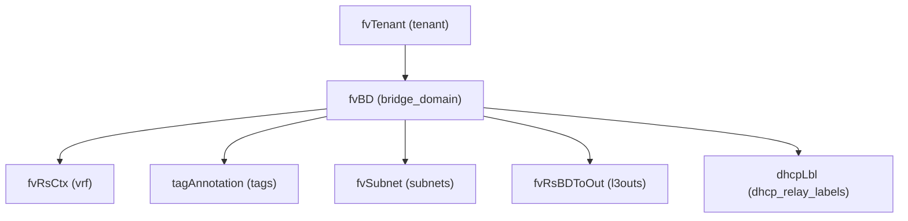

# Bridge Domain

**Task file:** `roles/tenant/tasks/bd.yml`
**Template:** `roles/tenant/templates/bd.json.j2`
**ACI MIT class:** `fvBD`

## Description

A Bridge Domain represents a Layer 2 forwarding domain within a tenant. It must
reference a VRF, and can carry subnets, DHCP relay labels, and bindings to L3Outs.
Several attributes' defaults change depending on whether `unicast_routing` is
enabled, mirroring the APIC GUI's own behavior when you flip that toggle.

## Object Relationships



## Attributes

Root object: `fvBD`

| Attribute | ACI Attribute | Required | Expected Value | Default |
|---|---|---|---|---|
| `name` | `name` | Yes | string | — |
| `vrf` | child `fvRsCtx.tnFvCtxName` | Yes | string | — |
| `description` | `descr` | No | string | `''` |
| `state` | `status` | No | `present` \| `absent` | `present` (see caveat below) |
| `unicast_routing` | `unicastRoute` | No | boolean | `false` |
| `endpoint_move_detection` | `epMoveDetectMode` | No | `''` \| `garp` | `''` |
| `l2_unknown_unicast` | `unkMacUcastAct` | No | `proxy` \| `flood` | `proxy` if `unicast_routing`, else `flood` |
| `l3_unknown_multicast` | `unkMcastAct` | No | `opt-flood` \| `flood` | `opt-flood` if `unicast_routing`, else `flood` |
| `arp_flood` | `arpFlood` | No | boolean | `false` if `unicast_routing`, else `true` |
| `PIM` | `mcastAllow` | No | boolean | `false` |
| `tags` | see [Tags](#tags) | No | array | `[]` |
| `subnets` | see [Subnets](#subnets) | No | array | `[]` |
| `l3outs` | see [L3Out Bindings](#l3out-bindings) | No | array | `[]` |
| `dhcp_relay_labels` | see [DHCP Relay Labels](#dhcp-relay-labels) | No | array | `[]` |

> **`state` default caveat:** `present` is only the default *if the task actually
> runs*. `roles/tenant/tasks/bd.yml` gates on `bd | has_nested_state`, which is
> `True` only when a `state` key exists *somewhere* in the BD's tree — on the
> BD itself, or on any subnet, tag, l3out binding, or DHCP relay label. If a BD
> entry has no `state` key anywhere at all, the task is skipped entirely: the
> BD is not created, updated, or touched in any way — it is not an implicit
> "create with defaults."
>
> For example, a BD with no `bd.state` but with a subnet carrying
> `state: absent` *will* run (has_nested_state is true): the BD itself is
> created/updated (state defaults to `present`) while that one subnet is
> deleted. But a BD with no `state` anywhere — not even on a subnet — never
> executes at all.

### Tags

Child object: `tagAnnotation`

| Attribute | ACI Attribute | Required | Expected Value | Default |
|---|---|---|---|---|
| `name` | `key` | Yes | string | — |
| `value` | `value` | Yes | string | — |
| `state` | `status` | No | `present` \| `absent` | `present` |

### Subnets

Child object: `fvSubnet`. The first entry in `subnets` is always rendered as
the `preferred` gateway; the rest are not.

| Attribute | ACI Attribute | Required | Expected Value | Default |
|---|---|---|---|---|
| `ip` | `ip` | Yes | string, e.g. `10.0.0.1/24` | — |
| `scope` | `scope` | No | `public` \| `private` | (omitted if unset) |
| `state` | `status` | No | `present` \| `absent` | `present` |

### L3Out Bindings

Child object: `fvRsBDToOut`

| Attribute | ACI Attribute | Required | Expected Value | Default |
|---|---|---|---|---|
| `name` | `tnL3extOutName` | Yes | string | — |
| `state` | `status` | No | `present` \| `absent` | `present` |

### DHCP Relay Labels

Child object: `dhcpLbl`

| Attribute | ACI Attribute | Required | Expected Value | Default |
|---|---|---|---|---|
| `name` | `name` | Yes | string | — |
| `scope` | `owner` | No | `infra` \| `tenant` | `tenant` |
| `state` | `status` | No | `present` \| `absent` | `present` |

## Examples

### Create a new Bridge Domain

```yaml
tenants:
  - name: tenant1
    bridge_domains:
      - name: bd1
        vrf: vrf1
        unicast_routing: true
        state: present
        subnets:
          - ip: 10.0.1.1/24
            scope: public
        l3outs:
          - name: l3out1
        dhcp_relay_labels:
          - name: dhcp-relay1
            scope: tenant
```

### Add a subnet to an existing Bridge Domain

Only the identifying `name` and the new subnet need to be given — fields
already set on the live object (`vrf`, `unicast_routing`, other subnets,
etc.) don't need to be repeated; the APIC POST merges into the existing
object rather than replacing it.

```yaml
tenants:
  - name: tenant1
    bridge_domains:
      - name: bd1
        subnets:
          - ip: 10.0.2.1/24
            scope: public
            state: present
```

Note the subnet's explicit `state: present`. Per the `state` default caveat
above, the BD's own `state` is left unset here (it isn't changing), but
`has_nested_state` requires *some* `state` key to exist somewhere in the
BD's tree for this task to run at all. Without `state: present` on the new
subnet — or `state: present` on the BD itself — there is no `state` key
anywhere in this entry, `has_nested_state` is `False`, the task is skipped,
and the subnet is silently never added.

### Remove a subnet from an existing Bridge Domain

```yaml
tenants:
  - name: tenant1
    bridge_domains:
      - name: bd1
        subnets:
          - ip: 10.0.2.1/24
            state: absent
```

Only the subnet being removed needs `ip` + `state: absent`; the BD itself
(and any other subnets) are left untouched — the BD's own `state` defaults
to `present` since it's omitted, and this one nested `state: absent` is
enough to make `has_nested_state` fire the task.

### Delete a Bridge Domain entirely

```yaml
tenants:
  - name: tenant1
    bridge_domains:
      - name: bd1
        state: absent
```

Setting `state: absent` on the BD itself deletes the whole `fvBD` (and
everything nested under it in ACI) — none of the other fields need to be
repeated to delete it.
