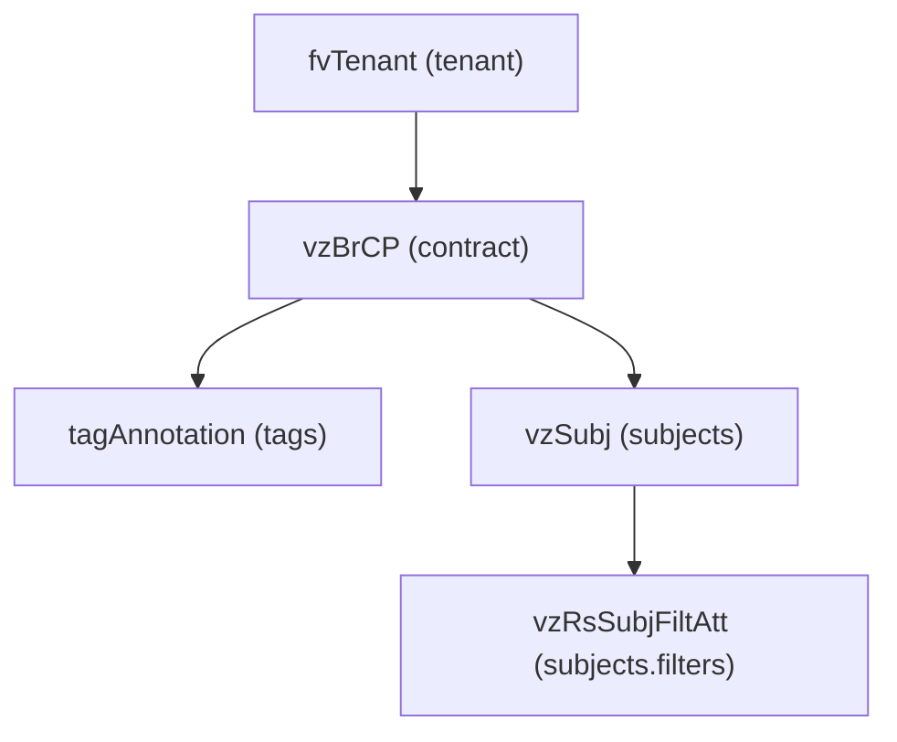

# Contract

**Task file:** `roles/tenant/tasks/contract.yml`
**Template:** `roles/tenant/templates/contract.json.j2`
**ACI MIT class:** `vzBrCP`

## Description

A Contract defines the communication rules (subjects and filters) that govern
traffic between EPGs/ESGs/external EPGs acting as providers and consumers.

## Object Relationships



## Attributes

Root object: `vzBrCP`

| Attribute | ACI Attribute | Required | Expected Value | Default |
|---|---|---|---|---|
| `name` | `name` | Yes | string | — |
| `description` | `descr` | No | string | `''` |
| `state` | `status` | No | `present` \| `absent` | `present` (see caveat below) |
| `scope` | `scope` | No | `context` \| `tenant` \| `global` | `context` |
| `tags` | see [Tags](#tags) | No | array | `[]` |
| `subjects` | see [Subjects](#subjects) | No | array | `[]` |

> **`state` default caveat:** `present` is only the default *if the task actually
> runs*. `roles/tenant/tasks/contract.yml` gates on `contract | has_nested_state`,
> which is `True` only when a `state` key exists *somewhere* in the contract's
> tree — on the contract itself, or on any tag, subject, or subject filter. A
> contract with no `state` key anywhere is skipped entirely: not created,
> updated, or touched. For example, a contract with no `contract.state` but
> with a subject filter carrying `state: absent` still runs (the contract
> itself defaults to `present` while that filter binding is removed); a
> contract with no `state` anywhere never executes.

### Tags

Child object: `tagAnnotation`

| Attribute | ACI Attribute | Required | Expected Value | Default |
|---|---|---|---|---|
| `name` | `key` | Yes | string | — |
| `value` | `value` | Yes | string | — |
| `state` | `status` | No | `present` \| `absent` | `present` |

### Subjects

Child object: `vzSubj`

| Attribute | ACI Attribute | Required | Expected Value | Default |
|---|---|---|---|---|
| `name` | `name` | Yes | string | — |
| `description` | `descr` | No | string | `''` |
| `reverse_filter_port` | `revFltPorts` | No | string (`'yes'`/`'no'`) | `'yes'` |
| `state` | `status` | No | `present` \| `absent` | `present` |
| `filters` | see [Subject Filters](#subject-filters) | No | array | `[]` |

### Subject Filters

Child object: `vzRsSubjFiltAtt`

| Attribute | ACI Attribute | Required | Expected Value | Default |
|---|---|---|---|---|
| `name` | `tnVzFilterName` | Yes | string | — |
| `action` | `action` | No | `permit` \| `deny` | `permit` |
| `log` | folded into `directives` (`log`) | No | boolean | `false` |
| `policy_compression` | folded into `directives` (`no_stats`) | No | boolean | `false` |
| `state` | `status` | No | `present` \| `absent` | `present` |

## Examples

### Create a new Contract

```yaml
tenants:
  - name: tenant1
    contracts:
      - name: web-to-app
        scope: context
        subjects:
          - name: http
            reverse_filter_port: 'yes'
            filters:
              - name: http-filter
                action: permit
                log: true
```

### Add a subject to an existing Contract

```yaml
tenants:
  - name: tenant1
    contracts:
      - name: web-to-app
        subjects:
          - name: https
            state: present
            filters:
              - name: https-filter
                action: permit
```

The new subject's `state: present` is what makes `has_nested_state` fire
this task — `contract.state` is left unset here since it isn't changing.

### Remove a subject from an existing Contract

```yaml
tenants:
  - name: tenant1
    contracts:
      - name: web-to-app
        subjects:
          - name: https
            state: absent
```

### Delete a Contract entirely

```yaml
tenants:
  - name: tenant1
    contracts:
      - name: web-to-app
        state: absent
```
