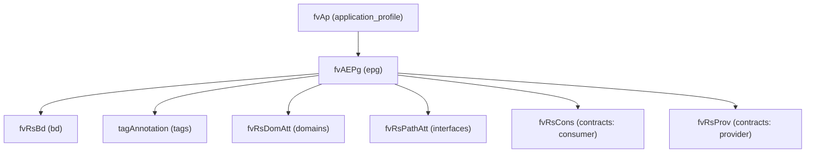

# Endpoint Group (EPG)

**Task file:** `roles/tenant/tasks/epg.yml`
**Template:** `roles/tenant/templates/epg.json.j2`
**ACI MIT class:** `fvAEPg`

## Description

An EPG groups endpoints that share the same policy (contracts, domain bindings,
static port bindings). It lives under an Application Profile and must reference a
Bridge Domain. This task loops over `(application_profile, epg)` pairs using
Ansible's `subelements` so each EPG can be created/deleted independently of its
parent AP.

## Object Relationships



## Attributes

Root object: `fvAEPg`

| Attribute | ACI Attribute | Required | Expected Value | Default |
|---|---|---|---|---|
| `name` | `name` | Yes | string | — |
| `bd` | child `fvRsBd.tnFvBDName` | Yes | string — bridge domain name | — |
| `description` | `descr` | No | string | `''` |
| `preferred_group_member` | `prefGrMemb` | No | `include` \| `exclude` | `exclude` |
| `state` | `status` | No | `present` \| `absent` | `present` (see caveat below) |
| `tags` | see [Tags](#tags) | No | array | `[]` |
| `domains` | see [Domain Bindings](#domain-bindings) | No | array | `[]` |
| `interfaces` | see [Static Port Bindings](#static-port-bindings) | No | array | `[]` |
| `contracts` | see [Contracts](#contracts) | No | array | `[]` |

> **`state` default caveat:** `present` is only the default *if the task actually
> runs*. `roles/tenant/tasks/epg.yml` gates on **two** conditions:
> `epg | has_nested_state` (a `state` key exists somewhere in the EPG's own
> tree — on the EPG itself, or on any tag, domain, interface, or contract), **and**
> the parent AP is not itself absent (`ap.state` is undefined or not `absent`).
> An EPG with `state` nowhere in its tree is skipped entirely — not created,
> not touched. And even an EPG that *does* have a nested state is skipped if
> its parent AP is being deleted (`ap.state: absent`) — deleting the AP takes
> the EPG with it, so there's nothing for this task to do.

### Tags

Child object: `tagAnnotation`

| Attribute | ACI Attribute | Required | Expected Value | Default |
|---|---|---|---|---|
| `name` | `key` | Yes | string | — |
| `value` | `value` | Yes | string | — |
| `state` | `status` | No | `present` \| `absent` | `present` |

### Domain Bindings

Child object: `fvRsDomAtt`

| Attribute | ACI Attribute | Required | Expected Value | Default |
|---|---|---|---|---|
| `name` | folded into `tDn` (`uni/phys-<name>` or `uni/vmmp-VMware/dom-<name>`) | Yes | string | — |
| `type` | selects `tDn` prefix (not a literal attribute) | Yes | `physical` \| `virtual` | — |
| `resolution` | `resImedcy` (virtual only) | No | `immediate` \| `lazy` \| `pre-provision` | `pre-provision` |
| `deployment` | `instrImedcy` (virtual only) | No | `immediate` \| `lazy` | `immediate` |
| `state` | `status` | No | `present` \| `absent` | `present` |

### Static Port Bindings

Child object: `fvRsPathAtt`

| Attribute | ACI Attribute | Required | Expected Value | Default |
|---|---|---|---|---|
| `leaf_id` | folded into `tDn` | Yes | integer | — |
| `pod` | folded into `tDn` | Yes | integer | — |
| `port` | folded into `tDn` (static-port form) | No | string | — |
| `ipg` | folded into `tDn` (IPG form) | No | string | — |
| `peer_leaf_id` | folded into `tDn` (vPC/protpaths form) | No | integer | — |
| `mode` | `mode` | Yes | `regular` \| `untagged` | — |
| `vlan` | `encap` (`vlan-<vlan>`) | Yes | integer | — |
| `deployment` | `instrImedcy` | No | `immediate` \| `lazy` | `immediate` |
| `state` | `status` | No | `present` \| `absent` | `present` |

### Contracts

Child object: `fvRsCons` (consumer) / `fvRsProv` (provider)

| Attribute | ACI Attribute | Required | Expected Value | Default |
|---|---|---|---|---|
| `name` | `tnVzBrCPName` | Yes | string | — |
| `type` | selects `fvRsCons` vs `fvRsProv` (not a literal attribute) | Yes | `provider` \| `consumer` | — |
| `state` | `status` | No | `present` \| `absent` | `present` |

## Examples

### Create a new EPG

```yaml
tenants:
  - name: tenant1
    application_profiles:
      - name: ap1
        epgs:
          - name: epg1
            bd: bd1
            state: present
            domains:
              - name: phys1
                type: physical
            interfaces:
              - leaf_id: 101
                pod: 1
                ipg: ipg1
                mode: regular
                vlan: 100
            contracts:
              - name: web-to-app
                type: consumer
```

### Add a contract to an existing EPG

```yaml
tenants:
  - name: tenant1
    application_profiles:
      - name: ap1
        epgs:
          - name: epg1
            contracts:
              - name: shared-services
                type: consumer
                state: present
```

The new contract binding's `state: present` is what makes `has_nested_state`
fire this task — `epg.state` is left unset here since it isn't changing.
This also requires the parent AP to not itself be `absent` (see caveat above).

### Remove a contract from an existing EPG

```yaml
tenants:
  - name: tenant1
    application_profiles:
      - name: ap1
        epgs:
          - name: epg1
            contracts:
              - name: shared-services
                state: absent
```

### Delete an EPG entirely

```yaml
tenants:
  - name: tenant1
    application_profiles:
      - name: ap1
        epgs:
          - name: epg1
            state: absent
```
