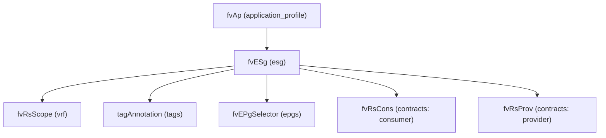

# Endpoint Security Group (ESG)

**Task file:** `roles/tenant/tasks/esg.yml`
**Template:** `roles/tenant/templates/esg.json.j2`
**ACI MIT class:** `fvESg`

## Description

An ESG groups endpoints by policy independently of network location (VRF-scoped,
not bound to a single bridge domain). It lives under an Application Profile, like
EPGs, and this task loops over `(application_profile, esg)` pairs via `subelements`.

## Object Relationships



## Attributes

Root object: `fvESg`

| Attribute | ACI Attribute | Required | Expected Value | Default |
|---|---|---|---|---|
| `name` | `name` | Yes | string | — |
| `vrf` | child `fvRsScope.tnFvCtxName` | Yes | string | — |
| `description` | `descr` | No | string | `''` |
| `preferred_group_member` | `prefGrMemb` | No | `include` \| `exclude` | `exclude` |
| `state` | `status` | No | `present` \| `absent` | `present` (see caveat below) |
| `tags` | see [Tags](#tags) | No | array | `[]` |
| `epgs` | see [EPG Members](#epg-members) | No | array | `[]` |
| `contracts` | see [Contracts](#contracts) | No | array | `[]` |

> **`state` default caveat:** `present` is only the default *if the task actually
> runs*. `roles/tenant/tasks/esg.yml` gates on **two** conditions:
> `esg | has_nested_state` (a `state` key exists somewhere in the ESG's own
> tree — on the ESG itself, or on any tag, EPG member, or contract), **and**
> the parent AP is not itself absent (`ap.state` is undefined or not `absent`).
> An ESG with `state` nowhere in its tree is skipped entirely. And even an ESG
> that does have a nested state is skipped if its parent AP is being deleted
> (`ap.state: absent`) — deleting the AP takes the ESG with it.

### Tags

Child object: `tagAnnotation`

| Attribute | ACI Attribute | Required | Expected Value | Default |
|---|---|---|---|---|
| `name` | `key` | Yes | string | — |
| `value` | `value` | Yes | string | — |
| `state` | `status` | No | `present` \| `absent` | `present` |

### EPG Members

Child object: `fvEPgSelector`

| Attribute | ACI Attribute | Required | Expected Value | Default |
|---|---|---|---|---|
| `name` | `name` / `matchEpgDn` | Yes | string — matches an EPG in the same AP | — |
| `state` | `status` | No | `present` \| `absent` | `present` |

### Contracts

Child object: `fvRsCons` (consumer) / `fvRsProv` (provider)

| Attribute | ACI Attribute | Required | Expected Value | Default |
|---|---|---|---|---|
| `name` | `tnVzBrCPName` | Yes | string | — |
| `type` | selects `fvRsCons` vs `fvRsProv` (not a literal attribute) | Yes | `provider` \| `consumer` | — |
| `state` | `status` | No | `present` \| `absent` | `present` |

## Examples

### Create a new ESG

```yaml
tenants:
  - name: tenant1
    application_profiles:
      - name: ap1
        esgs:
          - name: esg1
            vrf: vrf1
            state: present
            epgs:
              - name: epg1
            contracts:
              - name: web-to-app
                type: provider
```

### Add a member EPG to an existing ESG

```yaml
tenants:
  - name: tenant1
    application_profiles:
      - name: ap1
        esgs:
          - name: esg1
            epgs:
              - name: epg2
                state: present
```

The new member's `state: present` is what makes `has_nested_state` fire this
task — `esg.state` is left unset here since it isn't changing. This also
requires the parent AP to not itself be `absent` (see caveat above).

### Remove a member EPG from an existing ESG

```yaml
tenants:
  - name: tenant1
    application_profiles:
      - name: ap1
        esgs:
          - name: esg1
            epgs:
              - name: epg2
                state: absent
```

### Delete an ESG entirely

```yaml
tenants:
  - name: tenant1
    application_profiles:
      - name: ap1
        esgs:
          - name: esg1
            state: absent
```
