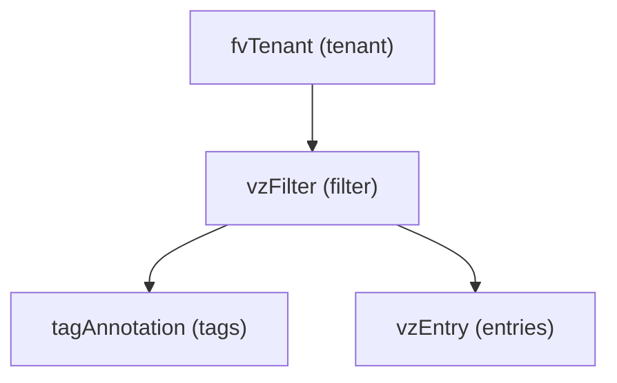

# Filter

**Task file:** `roles/tenant/tasks/filter.yml`
**Template:** `roles/tenant/templates/filter.json.j2`
**ACI MIT class:** `vzFilter`

## Description

A Filter is a reusable set of entries (protocol/port match criteria) referenced
by a contract subject.

## Object Relationships



## Attributes

Root object: `vzFilter`

| Attribute | ACI Attribute | Required | Expected Value | Default |
|---|---|---|---|---|
| `name` | `name` | Yes | string | — |
| `description` | `descr` | No | string | `''` |
| `state` | `status` | No | `present` \| `absent` | `present` (see caveat below) |
| `tags` | see [Tags](#tags) | No | array | `[]` |
| `entries` | see [Entries](#entries) | No | array | `[]` |

> **`state` default caveat:** `present` is only the default *if the task actually
> runs*. `roles/tenant/tasks/filter.yml` gates on `filter | has_nested_state`,
> which is `True` only when a `state` key exists *somewhere* in the filter's
> tree — on the filter itself, or on any tag or entry. A filter with no `state`
> key anywhere is skipped entirely: not created, updated, or touched. For
> example, a filter with no `filter.state` but with an entry carrying
> `state: absent` still runs (the filter itself defaults to `present` while
> that entry is removed); a filter with no `state` anywhere never executes.

### Tags

Child object: `tagAnnotation`

| Attribute | ACI Attribute | Required | Expected Value | Default |
|---|---|---|---|---|
| `name` | `key` | Yes | string | — |
| `value` | `value` | Yes | string | — |
| `state` | `status` | No | `present` \| `absent` | `present` |

### Entries

Child object: `vzEntry`

| Attribute | ACI Attribute | Required | Expected Value | Default |
|---|---|---|---|---|
| `name` | `name` | Yes | string | — |
| `description` | `descr` | No | string | `''` |
| `ethertype` | `etherT` | No | `unspecified`, `arp`, `fcoe`, `ip`, `ipv4`, `ipv6`, `mac_security`, `mpls_ucast`, `trill` | `unspecified` |
| `ip_protocol` | `prot` | No | `unspecified`, `icmp`, `icmpv6`, `igmp`, `tcp`, `udp`, `eigrp`, `egp`, `igp`, `ospfigp`, `pim`, `l2tp`, or a numeric string | `unspecified` |
| `from_port` | `dFromPort` | No | integer (0-65535) or `unspecified`/`dns`/`ftpData`/`http`/`https`/`pop3`/`rtsp`/`smtp` | `unspecified` |
| `to_port` | `dToPort` | No | same as `from_port` | `unspecified` |
| `state` | `status` | No | `present` \| `absent` | `present` |

## Examples

### Create a new Filter

```yaml
tenants:
  - name: tenant1
    filters:
      - name: http-filter
        entries:
          - name: http
            ethertype: ip
            ip_protocol: tcp
            from_port: http
            to_port: http
```

### Add an entry to an existing Filter

```yaml
tenants:
  - name: tenant1
    filters:
      - name: http-filter
        entries:
          - name: https
            state: present
            ethertype: ip
            ip_protocol: tcp
            from_port: https
            to_port: https
```

The new entry's `state: present` is what makes `has_nested_state` fire this
task — `filter.state` is left unset here since it isn't changing.

### Remove an entry from an existing Filter

```yaml
tenants:
  - name: tenant1
    filters:
      - name: http-filter
        entries:
          - name: https
            state: absent
```

### Delete a Filter entirely

```yaml
tenants:
  - name: tenant1
    filters:
      - name: http-filter
        state: absent
```
