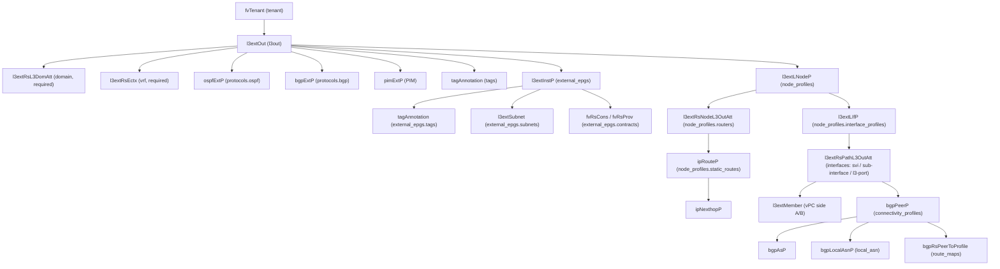

# L3Out

**Task file:** `roles/tenant/tasks/l3out.yml`
**Templates:** `roles/tenant/templates/l3out.json.j2`, `l3out_ext_epg.json.j2`, `bgp_peer.json.j2`
**ACI MIT class:** `l3extOut`

## Description

An L3Out defines external Layer 3 connectivity for a tenant's VRF: the routing
protocols spoken (OSPF/BGP), the external EPGs (routed subnets and their
contracts), and the node/interface-level configuration (routers, static routes,
SVI/sub-interface/routed-port bindings, and per-neighbor BGP connectivity
profiles). This is the largest object in the model — the sections below are
nested several levels deep, matching the real MIT tree.

## Object Relationships



## Attributes

Root object: `l3extOut`

| Attribute | ACI Attribute | Required | Expected Value | Default |
|---|---|---|---|---|
| `name` | `name` | Yes | string | — |
| `vrf` | child `l3extRsEctx.tnFvCtxName` | Yes | string | — |
| `domain` | child `l3extRsL3DomAtt.tDn` (`uni/l3dom-<domain>`) | Yes | string — L3 domain name | — |
| `description` | `descr` | No | string | `''` |
| `state` | `status` | No | `present` \| `absent` | `present` (see caveat below) |
| `import_route_control` | folded into `enforceRtctrl` (`import`) | No | boolean | `true` |
| `export_route_control` | folded into `enforceRtctrl` (`export`) | No | boolean | `false` |
| `PIM` | child `pimExtP` presence (`enabledAf: ipv4-mcast`, `name: pim`) | No | boolean — presence renders `pimExtP` | (omitted if unset) |
| `tags` | see [Tags](#tags) | No | array | `[]` |
| `protocols.ospf.area_id` | child `ospfExtP.areaId` | Yes, if `ospf` set | `backbone`, dotted-decimal, or numeric string | — |
| `protocols.ospf.area_type` | child `ospfExtP.areaType` | No | `regular` \| `stub` \| `nssa` | `regular` |
| `protocols.ospf.area_cost` | child `ospfExtP.areaCost` | No | integer | `1` |
| `protocols.ospf.state` | child `ospfExtP.status` | No | `present` \| `absent` | `present` |
| `protocols.bgp` | child `bgpExtP` presence | No | `null` or an object — presence renders `bgpExtP` | — |
| `protocols.bgp.state` | child `bgpExtP.status` | No | `present` \| `absent` | `present` |
| `external_epgs` | see [External EPGs](#external-epgs) | No | array | `[]` |
| `node_profiles` | see [Node Profiles](#node-profiles) | No | array | `[]` |

> **`state` default caveat:** `present` is only the default *if the task actually
> runs*. `roles/tenant/tasks/l3out.yml` gates on `l3out | has_nested_state`,
> which is `True` only when a `state` key exists *anywhere* in the L3Out's
> tree — on the L3Out itself, on `protocols.ospf`/`protocols.bgp`, on `tags`,
> or nested arbitrarily deep inside `external_epgs` (including their subnets/
> contracts) or `node_profiles` (including their routers/static routes/
> interface profiles/connectivity profiles/route maps). An L3Out with no
> `state` key anywhere in that whole tree is skipped entirely: not created,
> updated, or touched. For example, an L3Out with no `l3out.state` but with a
> BGP connectivity profile's route map carrying `state: absent`, ten levels
> deep, still runs (the L3Out itself defaults to `present` while that one
> route-map binding is removed); an L3Out with no `state` anywhere never
> executes.

### Tags

Child object: `tagAnnotation` — shared shape for `tags` at every level of this doc

| Attribute | ACI Attribute | Required | Expected Value | Default |
|---|---|---|---|---|
| `name` | `key` | Yes | string | — |
| `value` | `value` | Yes | string | — |
| `state` | `status` | No | `present` \| `absent` | `present` |

## External EPGs

ACI MIT class: `l3extInstP`

| Attribute | ACI Attribute | Required | Expected Value | Default |
|---|---|---|---|---|
| `name` | `name` | Yes | string | — |
| `description` | `descr` | No | string | `''` |
| `preferred_group_member` | `prefGrMemb` | No | `include` \| `exclude` | `exclude` |
| `state` | `status` | No | `present` \| `absent` | `present` |
| `tags` | see [Tags](#tags) | No | array | `[]` |
| `subnets` | see [External EPG Subnets](#external-epg-subnets) | No | array | `[]` |
| `contracts` | see [External EPG Contracts](#external-epg-contracts) | No | array | `[]` |

### External EPG Subnets

Child object: `l3extSubnet`

| Attribute | ACI Attribute | Required | Expected Value | Default |
|---|---|---|---|---|
| `ip` | `ip` | Yes | string | — |
| `description` | `descr` | No | string | `''` |
| `agg_export` | folded into `aggregate` (`export-rtctrl`) | No | boolean | `false` |
| `agg_inport` | folded into `aggregate` (`inport-rtctrl`) | No | boolean | `false` |
| `agg_shared` | folded into `aggregate` (`shared-rtctrl`) | No | boolean | `false` |
| `export_route_ctrl` | folded into `scope` (`export-rtctrl`) | No | boolean | `false` |
| `external_epg` | folded into `scope` (`import-security`) | No | boolean | `false` |
| `shared_route_ctrl` | folded into `scope` (`shared-rtctrl`) | No | boolean | `false` |
| `shared_security_import` | folded into `scope` (`shared-security`) | No | boolean | `false` |
| `state` | `status` | No | `present` \| `absent` | `present` |

### External EPG Contracts

Child object: `fvRsCons` (consumer) / `fvRsProv` (provider)

| Attribute | ACI Attribute | Required | Expected Value | Default |
|---|---|---|---|---|
| `name` | `tnVzBrCPName` | Yes | string | — |
| `type` | selects `fvRsCons` vs `fvRsProv` (not a literal attribute) | Yes | `provider` \| `consumer` | — |
| `state` | `status` | No | `present` \| `absent` | `present` |

## Node Profiles

ACI MIT class: `l3extLNodeP`

| Attribute | ACI Attribute | Required | Expected Value | Default |
|---|---|---|---|---|
| `name` | `name` | Yes | string | — |
| `state` | `status` | No | `present` \| `absent` | `present` |
| `routers` | see [Routers](#routers) | No | array | `[]` |
| `static_routes` | see [Static Routes](#static-routes) — created under **every** router in `routers`, not a sibling of them | No | array | `[]` |
| `interface_profiles` | see [Interface Profiles](#interface-profiles) | No | array | `[]` |

### Routers

Child object: `l3extRsNodeL3OutAtt`

| Attribute | ACI Attribute | Required | Expected Value | Default |
|---|---|---|---|---|
| `pod` | folded into `tDn` (`topology/pod-<pod>/node-<leaf_id>`) | Yes | integer | — |
| `leaf_id` | folded into `tDn` (`topology/pod-<pod>/node-<leaf_id>`) | Yes | integer | — |
| `router_id` | `rtrId` | Yes | string | — |
| `loopback` | `rtrIdLoopBack` | No | boolean | `false` |
| `state` | `status` | No | `present` \| `absent` | `present` |

### Static Routes

Child object: `ipRouteP` (with a nested `ipNexthopP`). Despite being listed as
its own `node_profiles[].static_routes` array (a sibling of `routers` in the
config), each route is actually rendered as a child of **every** router in
that same node profile's `routers` list — the template loops over
`nprof.static_routes` once per router, not once per node profile. This means
a node profile with 2 routers and 3 static routes renders 2
`l3extRsNodeL3OutAtt` objects, **each** carrying all 3 `ipRouteP` children (6
total) — the routes are not split or scoped per router; there's no way in
this config to give one router a route the other doesn't get.

| Attribute | ACI Attribute | Required | Expected Value | Default |
|---|---|---|---|---|
| `prefix` | `ipRouteP.ip` | Yes | string | — |
| `nhop` | grandchild `ipNexthopP.nhAddr` | Yes | string | — |
| `state` | `ipRouteP.status` / grandchild `ipNexthopP.status` | No | `present` \| `absent` | `present` |

## Interface Profiles

ACI MIT class: `l3extLIfP`

| Attribute | ACI Attribute | Required | Expected Value | Default |
|---|---|---|---|---|
| `name` | `name` | Yes | string | — |
| `state` | `status` | No | `present` \| `absent` | `present` |
| `interfaces` | see [Typed Interfaces](#typed-interfaces) | No | object — `{svi: [...], sub-interface: [...], l3-port: [...]}` | `{}` |

### Typed Interfaces

Child object: `l3extRsPathL3OutAtt`. Interfaces are grouped by type under
`interfaces: {svi: [...], sub-interface: [...], l3-port: [...]}`. `svi`
entries require `vlan` + `mode`; `sub-interface` entries require `vlan`;
`l3-port` entries need neither.

| Attribute | ACI Attribute | Required | Expected Value | Default |
|---|---|---|---|---|
| `pod` | used to build `tDn` (`paths-`/`protpaths-`) | No | integer | — |
| `leaf_id` | used to build `tDn` (`paths-`/`protpaths-`) | No | integer | — |
| `port` | used to build `tDn` (`paths-` form) | No | string — static-port form | — |
| `ipg` | used to build `tDn` (`paths-`/`protpaths-` form) | No | string — IPG form | — |
| `peer_leaf_id` | used to build `tDn` (`protpaths-` form) | No | integer — vPC form | — |
| `mode` | `mode` (svi only) | No | `regular` \| `untagged` \| `native` (svi only) | — |
| `vlan` | folded into `encap` (`vlan-<vlan>`) | No | integer (svi / sub-interface) | — |
| `addr` | `addr`, or child `l3extMember.addr` side A when `peer_leaf_id` is set | Yes | string | — |
| `peer_addr` | child `l3extMember.addr` side B | No | string — vPC peer side B address | — |
| `mtu` | `mtu` | No | `inherit` or integer (576-9216) | `inherit` |
| `state` | `status` | No | `present` \| `absent` | `present` |
| `connectivity_profiles` | see [Connectivity Profiles](#connectivity-profiles) | No | array | `[]` |

### Connectivity Profiles

Child object: `bgpPeerP`

| Attribute | ACI Attribute | Required | Expected Value | Default |
|---|---|---|---|---|
| `peer_address` | `addr` | Yes | string | — |
| `remote_asn` | grandchild `bgpAsP.asn` | Yes | integer | — |
| `local_asn` | grandchild `bgpLocalAsnP.localAsn` | No | integer | (omitted if unset — no `bgpLocalAsnP`) |
| `description` | `descr` | No | string | `''` |
| `send_community` | folded into `ctrl` (`send-com`) | No | boolean | `false` |
| `send_extended_community` | folded into `ctrl` (`send-ext-com`) | No | boolean | `false` |
| `bfd` | folded into `peerCtrl` (`bfd`) | No | boolean | `false` |
| `weight` | `weight` | No | integer | `0` |
| `ttl` | `ttl` | No | integer | `1` |
| `state` | `status` | No | `present` \| `absent` | `present` |
| `route_maps` | see [Peer Route Maps](#peer-route-maps) | No | array | `[]` |

### Peer Route Maps

Child object: `bgpRsPeerToProfile`

| Attribute | ACI Attribute | Required | Expected Value | Default |
|---|---|---|---|---|
| `name` | folded into `tDn` (`uni/tn-<tenant>/prof-<name>`) | Yes | string | — |
| `direction` | `direction` | Yes | `import` \| `export` | — |
| `state` | `status` | No | `present` \| `absent` | `present` |

## Examples

### Create a new L3Out

```yaml
tenants:
  - name: tenant1
    l3outs:
      - name: l3out1
        vrf: vrf1
        domain: l3out1-dom
        protocols:
          ospf:
            area_id: "0.0.0.1"
            area_type: regular
        external_epgs:
          - name: ext-epg1
            subnets:
              - ip: 0.0.0.0/0
                external_epg: true
            contracts:
              - name: shared-services
                type: consumer
        node_profiles:
          - name: nprof1
            routers:
              - pod: 1
                leaf_id: 101
                router_id: 1.1.1.1
                loopback: true
            interface_profiles:
              - name: iprof1
                interfaces:
                  svi:
                    - pod: 1
                      leaf_id: 101
                      ipg: ipg1
                      vlan: 10
                      mode: regular
                      addr: 10.10.10.1/30
                      connectivity_profiles:
                        - peer_address: 10.10.10.2
                          remote_asn: 65001
```

### Add an external EPG to an existing L3Out

```yaml
tenants:
  - name: tenant1
    l3outs:
      - name: l3out1
        external_epgs:
          - name: ext-epg2
            state: present
            subnets:
              - ip: 10.10.0.0/16
```

The new external EPG's `state: present` is what makes `has_nested_state`
fire this task — `l3out.state` is left unset here since it isn't changing
(see caveat above — this also works with `state` set on any deeper nested
field instead, e.g. just the subnet).

### Remove an external EPG from an existing L3Out

```yaml
tenants:
  - name: tenant1
    l3outs:
      - name: l3out1
        external_epgs:
          - name: ext-epg2
            state: absent
```

### Delete an L3Out entirely

```yaml
tenants:
  - name: tenant1
    l3outs:
      - name: l3out1
        state: absent
```
