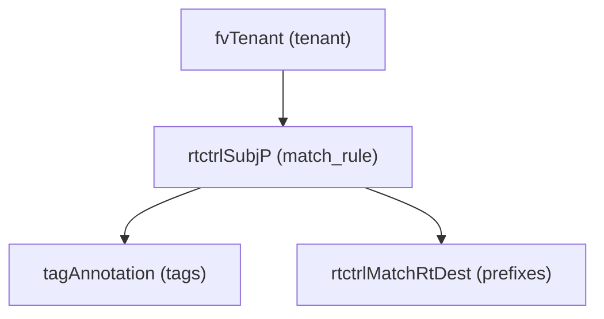

# Match Rule

**Task file:** `roles/tenant/tasks/match_rule.yml`
**Template:** `roles/tenant/templates/match_rule.json.j2`
**ACI MIT class:** `rtctrlSubjP`

## Description

A Match Rule (route-map match profile) defines prefix-based match criteria that
a Route Map context can reference. Configured under `tenant.policies.match_rules`.

## Object Relationships



## Attributes

Root object: `rtctrlSubjP`

| Attribute | ACI Attribute | Required | Expected Value | Default |
|---|---|---|---|---|
| `name` | `name` | Yes | string | — |
| `description` | `descr` | No | string | `''` |
| `state` | `status` | No | `present` \| `absent` | `present` (see caveat below) |
| `tags` | see [Tags](#tags) | No | array | `[]` |
| `prefixes` | see [Prefixes](#prefixes) | No | array | `[]` |

> **`state` default caveat:** `present` is only the default *if the task actually
> runs*. `roles/tenant/tasks/match_rule.yml` gates on `rule | has_nested_state`,
> which is `True` only when a `state` key exists *somewhere* in the match
> rule's tree — on the rule itself, or on any tag or prefix. A match rule with
> no `state` key anywhere is skipped entirely: not created, updated, or
> touched — it is not an implicit "create with defaults."

### Tags

Child object: `tagAnnotation`

| Attribute | ACI Attribute | Required | Expected Value | Default |
|---|---|---|---|---|
| `name` | `key` | Yes | string | — |
| `value` | `value` | Yes | string | — |
| `state` | `status` | No | `present` \| `absent` | `present` |

### Prefixes

Child object: `rtctrlMatchRtDest`

| Attribute | ACI Attribute | Required | Expected Value | Default |
|---|---|---|---|---|
| `ip` | `ip` | Yes | string, e.g. `10.0.0.0/8` | — |
| `description` | `descr` | No | string | (omitted if unset) |
| `aggregate` | `aggregate` | No | boolean | (omitted if unset) |
| `greater_equal_mask` | `fromPfxLen` | No | integer | (omitted if unset) |
| `less_equal_mask` | `toPfxLen` | No | integer | (omitted if unset) |
| `state` | `status` | No | `present` \| `absent` | `present` |

## Examples

### Create a new Match Rule

```yaml
tenants:
  - name: tenant1
    policies:
      match_rules:
        - name: match-default
          prefixes:
            - ip: 0.0.0.0/0
              aggregate: true
              greater_equal_mask: 0
              less_equal_mask: 32
```

### Add a prefix to an existing Match Rule

```yaml
tenants:
  - name: tenant1
    policies:
      match_rules:
        - name: match-default
          prefixes:
            - ip: 10.0.0.0/8
              state: present
```

The new prefix's `state: present` is what makes `has_nested_state` fire this
task — `rule.state` is left unset here since it isn't changing.

### Remove a prefix from an existing Match Rule

```yaml
tenants:
  - name: tenant1
    policies:
      match_rules:
        - name: match-default
          prefixes:
            - ip: 10.0.0.0/8
              state: absent
```

### Delete a Match Rule entirely

```yaml
tenants:
  - name: tenant1
    policies:
      match_rules:
        - name: match-default
          state: absent
```
