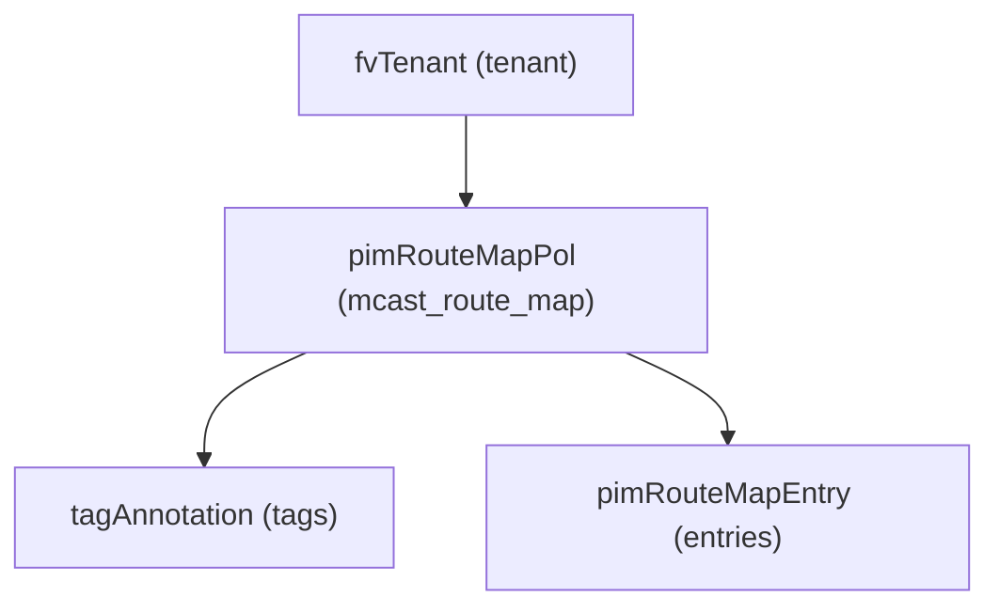

# Multicast Route Map

**Task file:** `roles/tenant/tasks/mcast_route_map.yml`
**Template:** `roles/tenant/templates/mcast_route_map.json.j2`
**ACI MIT class:** `pimRouteMapPol`

## Description

A Multicast Route Map filters/permits (S,G) or (*,G) multicast routes, and is
referenced by a VRF's PIM static rendezvous-point configuration. Configured
under `tenant.policies.mcast_route_maps`.

## Object Relationships



## Attributes

Root object: `pimRouteMapPol`

| Attribute | ACI Attribute | Required | Expected Value | Default |
|---|---|---|---|---|
| `name` | `name` | Yes | string | — |
| `description` | `descr` | No | string | `''` |
| `state` | `status` | No | `present` \| `absent` | `present` (see caveat below) |
| `tags` | see [Tags](#tags) | No | array | `[]` |
| `entries` | see [Entries](#entries) | No | array | `[]` |

> **`state` default caveat:** `present` is only the default *if the task actually
> runs*. `roles/tenant/tasks/mcast_route_map.yml` gates on
> `mcast_route_map | has_nested_state`, which is `True` only when a `state`
> key exists *somewhere* in the route map's tree — on the route map itself, or
> on any tag or entry. A multicast route map with no `state` key anywhere is
> skipped entirely: not created, updated, or touched.

### Tags

Child object: `tagAnnotation`

| Attribute | ACI Attribute | Required | Expected Value | Default |
|---|---|---|---|---|
| `name` | `key` | Yes | string | — |
| `value` | `value` | Yes | string | — |
| `state` | `status` | No | `present` \| `absent` | `present` |

### Entries

Child object: `pimRouteMapEntry`

| Attribute | ACI Attribute | Required | Expected Value | Default |
|---|---|---|---|---|
| `order` | `order` | Yes | integer | — |
| `group` | `grp` | Yes | string, CIDR e.g. `239.1.1.0/24` | — |
| `rp` | `rp` | Yes | string, `/32` e.g. `10.0.0.5/32` | — |
| `source` | `src` | No | string, IP or CIDR | `0.0.0.0` |
| `action` | `action` | Yes | `permit` \| `deny` | — |
| `state` | `status` | No | `present` \| `absent` | `present` |

## Examples

### Create a new Multicast Route Map

```yaml
tenants:
  - name: tenant1
    policies:
      mcast_route_maps:
        - name: rp-filter
          entries:
            - order: 0
              group: 239.1.1.0/24
              rp: 10.0.0.5/32
              action: permit
```

### Add an entry to an existing Multicast Route Map

```yaml
tenants:
  - name: tenant1
    policies:
      mcast_route_maps:
        - name: rp-filter
          entries:
            - order: 1
              group: 239.2.2.0/24
              rp: 10.0.0.6/32
              action: deny
              state: present
```

The new entry's `state: present` is what makes `has_nested_state` fire this
task — `mcast_route_map.state` is left unset here since it isn't changing.

### Remove an entry from an existing Multicast Route Map

```yaml
tenants:
  - name: tenant1
    policies:
      mcast_route_maps:
        - name: rp-filter
          entries:
            - order: 1
              group: 239.2.2.0/24
              rp: 10.0.0.6/32
              action: deny
              state: absent
```

### Delete a Multicast Route Map entirely

```yaml
tenants:
  - name: tenant1
    policies:
      mcast_route_maps:
        - name: rp-filter
          state: absent
```
