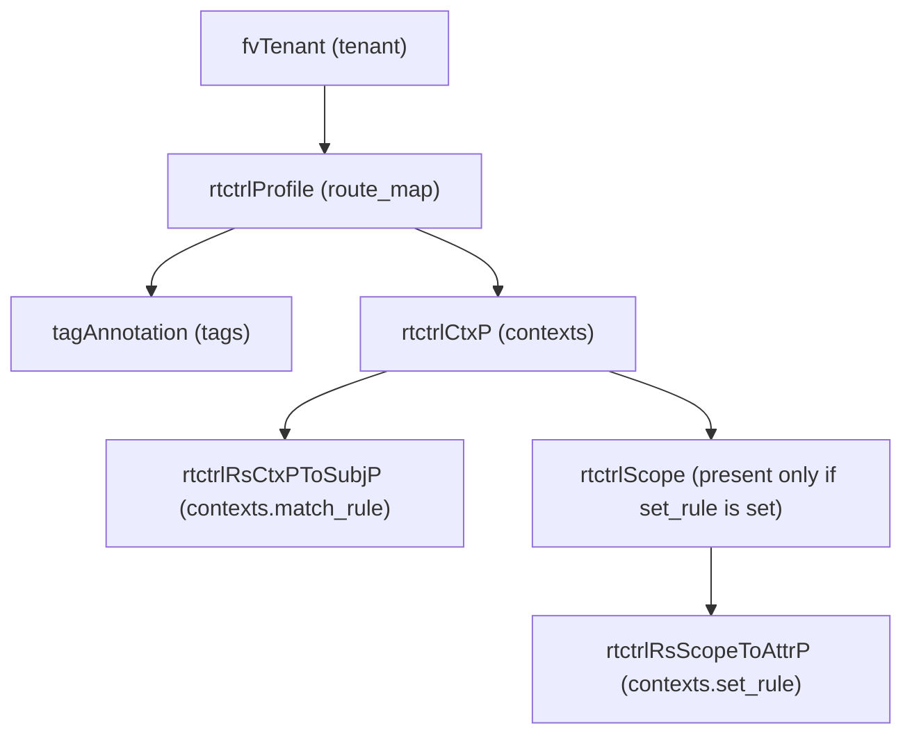

# Route Map

**Task file:** `roles/tenant/tasks/route_map.yml`
**Template:** `roles/tenant/templates/route_map.json.j2`
**ACI MIT class:** `rtctrlProfile`

## Description

A Route Map (route-control profile) chains ordered contexts, each optionally
binding a Match Rule and/or a Set Rule, to control route import/export (used by
VRF static-RP filtering and L3Out BGP peer route-maps). Configured under
`tenant.policies.route_maps`.

## Object Relationships



## Attributes

Root object: `rtctrlProfile`

| Attribute | ACI Attribute | Required | Expected Value | Default |
|---|---|---|---|---|
| `name` | `name` | Yes | string | — |
| `description` | `descr` | No | string | `''` |
| `state` | `status` | No | `present` \| `absent` | `present` (see caveat below) |
| `tags` | see [Tags](#tags) | No | array | `[]` |
| `contexts` | see [Contexts](#contexts) | No | array | `[]` |

> **`state` default caveat:** `present` is only the default *if the task actually
> runs*. `roles/tenant/tasks/route_map.yml` gates on
> `route_map | has_nested_state`, which is `True` only when a `state` key
> exists *somewhere* in the route map's tree — on the route map itself, or on
> any tag or context. A route map with no `state` key anywhere is skipped
> entirely: not created, updated, or touched.

### Tags

Child object: `tagAnnotation`

| Attribute | ACI Attribute | Required | Expected Value | Default |
|---|---|---|---|---|
| `name` | `key` | Yes | string | — |
| `value` | `value` | Yes | string | — |
| `state` | `status` | No | `present` \| `absent` | `present` |

### Contexts

Child object: `rtctrlCtxP`

| Attribute | ACI Attribute | Required | Expected Value | Default |
|---|---|---|---|---|
| `name` | `name` | Yes | string | — |
| `order` | `order` | Yes | integer | — |
| `action` | `action` | Yes | `permit` \| `deny` | — |
| `description` | `descr` | No | string | `''` |
| `match_rule` | grandchild `rtctrlRsCtxPToSubjP.tnRtctrlSubjPName` | No | string — references a Match Rule by name | (no binding if unset) |
| `set_rule` | grandchild `rtctrlScope > rtctrlRsScopeToAttrP.tnRtctrlAttrPName` | No | string — references a Set Rule by name | (no binding if unset) |
| `state` | `status` | No | `present` \| `absent` | `present` |

## Examples

### Create a new Route Map

```yaml
tenants:
  - name: tenant1
    policies:
      route_maps:
        - name: export-map
          contexts:
            - name: ctx10
              order: 10
              action: permit
              match_rule: match-default
              set_rule: prepend-3x
```

### Add a context to an existing Route Map

```yaml
tenants:
  - name: tenant1
    policies:
      route_maps:
        - name: export-map
          contexts:
            - name: ctx20
              order: 20
              action: deny
              state: present
```

The new context's `state: present` is what makes `has_nested_state` fire
this task — `route_map.state` is left unset here since it isn't changing.

### Remove a context from an existing Route Map

```yaml
tenants:
  - name: tenant1
    policies:
      route_maps:
        - name: export-map
          contexts:
            - name: ctx20
              state: absent
```

### Delete a Route Map entirely

```yaml
tenants:
  - name: tenant1
    policies:
      route_maps:
        - name: export-map
          state: absent
```
