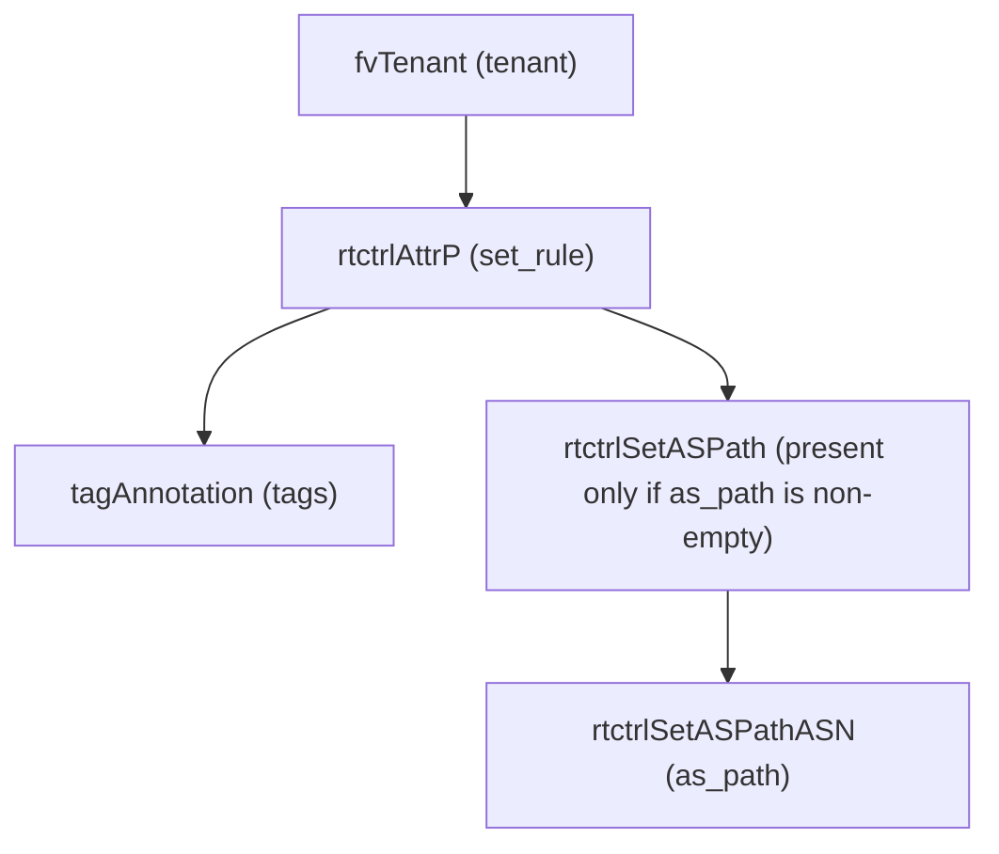

# Set Rule

**Task file:** `roles/tenant/tasks/set_rule.yml`
**Template:** `roles/tenant/templates/set_rule.json.j2`
**ACI MIT class:** `rtctrlAttrP`

## Description

A Set Rule (route-map set profile) defines attribute-modification actions (e.g.
AS-path prepending) that a Route Map context can reference. Configured under
`tenant.policies.set_rules`.

## Object Relationships



## Attributes

Root object: `rtctrlAttrP`

| Attribute | ACI Attribute | Required | Expected Value | Default |
|---|---|---|---|---|
| `name` | `name` | Yes | string | — |
| `description` | `descr` | No | string | `''` |
| `state` | `status` | No | `present` \| `absent` | `present` (see caveat below) |
| `tags` | see [Tags](#tags) | No | array | `[]` |
| `as_path` | see [AS Path](#as-path) | No | array | `[]` |

> **`state` default caveat:** `present` is only the default *if the task actually
> runs*. `roles/tenant/tasks/set_rule.yml` gates on `set_rule | has_nested_state`,
> which is `True` only when a `state` key exists *somewhere* in the set rule's
> tree — on the rule itself, or on any tag or AS-path hop. A set rule with no
> `state` key anywhere is skipped entirely: not created, updated, or touched.

### Tags

Child object: `tagAnnotation`

| Attribute | ACI Attribute | Required | Expected Value | Default |
|---|---|---|---|---|
| `name` | `key` | Yes | string | — |
| `value` | `value` | Yes | string | — |
| `state` | `status` | No | `present` \| `absent` | `present` |

### AS Path

Child object: `rtctrlSetASPathASN`, under a `rtctrlSetASPath` wrapper always
rendered with `criteria: prepend` / `type: as-path`.

| Attribute | ACI Attribute | Required | Expected Value | Default |
|---|---|---|---|---|
| `order` | `order` | Yes | integer | — |
| `asn` | `asn` | Yes | integer | — |
| `description` | `descr` | No | string | `''` |
| `state` | `status` | No | `present` \| `absent` | `present` |

## Examples

### Create a new Set Rule

```yaml
tenants:
  - name: tenant1
    policies:
      set_rules:
        - name: prepend-3x
          as_path:
            - order: 0
              asn: 65001
            - order: 1
              asn: 65001
```

### Add an AS-path hop to an existing Set Rule

```yaml
tenants:
  - name: tenant1
    policies:
      set_rules:
        - name: prepend-3x
          as_path:
            - order: 2
              asn: 65001
              state: present
```

The new hop's `state: present` is what makes `has_nested_state` fire this
task — `set_rule.state` is left unset here since it isn't changing.

### Remove an AS-path hop from an existing Set Rule

```yaml
tenants:
  - name: tenant1
    policies:
      set_rules:
        - name: prepend-3x
          as_path:
            - order: 2
              state: absent
```

### Delete a Set Rule entirely

```yaml
tenants:
  - name: tenant1
    policies:
      set_rules:
        - name: prepend-3x
          state: absent
```
