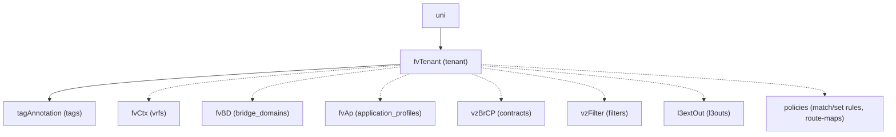

# Tenant

**Task file:** `roles/tenant/tasks/tenant.yml`
**Template:** `roles/tenant/templates/tenant.json.j2`
**ACI MIT class:** `fvTenant`

## Description

A Tenant is the top-level administrative container in the ACI policy model. It owns
VRFs, bridge domains, application profiles, contracts, filters, L3Outs and
tenant-scoped policies (route-maps, match/set rules). Every other object managed by
this role's `tenant` role lives underneath one `fvTenant`.

## Object Relationships



Dashed edges are managed by their own separate tasks/docs, not rendered by this template.

## Attributes

Root object: `fvTenant`

| Attribute | ACI Attribute | Required | Expected Value | Default |
|---|---|---|---|---|
| `name` | `name` | Yes | string | — |
| `description` | `descr` | No | string | `''` |
| `state` | `status` | No | `present` \| `absent` | `present` (see caveat below) |
| `tags` | see [Tags](#tags) | No | array | `[]` |

> **`state` default caveat:** `present` is only the default *if the task actually
> runs*. `roles/tenant/tasks/tenant.yml` gates on
> `tenant | has_nested_state(include_keys=['tags'])` — note the `include_keys`
> restriction: only a `state` key on the tenant itself or inside `tags` causes
> the task to run. A `state` set deep inside `vrfs`, `bridge_domains`,
> `application_profiles`, `contracts`, `filters`, `l3outs`, or `policies` does
> **not** count here (those are handled by their own separate tasks/docs with
> their own gating) — so a tenant with no `state` anywhere on itself or its
> tags, but with e.g. a VRF carrying `state: absent`, still has its *own* task
> skipped; only the VRF's task runs. A tenant with `state` nowhere in scope at
> all is skipped entirely: not created, not touched.

### Tags

Child object: `tagAnnotation`

| Attribute | ACI Attribute | Required | Expected Value | Default |
|---|---|---|---|---|
| `name` | `key` | Yes | string | — |
| `value` | `value` | Yes | string | — |
| `state` | `status` | No | `present` \| `absent` | `present` |

## Examples

### Create a new Tenant

```yaml
tenants:
  - name: tenant1
    description: "Example tenant"
    state: present
    tags:
      - name: owner
        value: network-team
```

### Add a tag to an existing Tenant

```yaml
tenants:
  - name: tenant1
    tags:
      - name: cost-center
        value: "1234"
        state: present
```

The new tag's `state: present` is what makes `has_nested_state(include_keys=['tags'])`
fire this task — `tenant.state` is left unset here since it isn't changing.

### Remove a tag from an existing Tenant

```yaml
tenants:
  - name: tenant1
    tags:
      - name: cost-center
        state: absent
```

### Delete a Tenant entirely

```yaml
tenants:
  - name: tenant1
    state: absent
```

Deleting a tenant deletes everything under it in ACI (VRFs, BDs, APs, etc.),
but note that `has_nested_state(include_keys=['tags'])` only looks at the
tenant's own `state`/`tags` to decide whether *this* task runs — the other
per-object tasks (VRF, BD, ...) have their own independent gating and don't
need their `state` set for the tenant deletion itself to happen.
