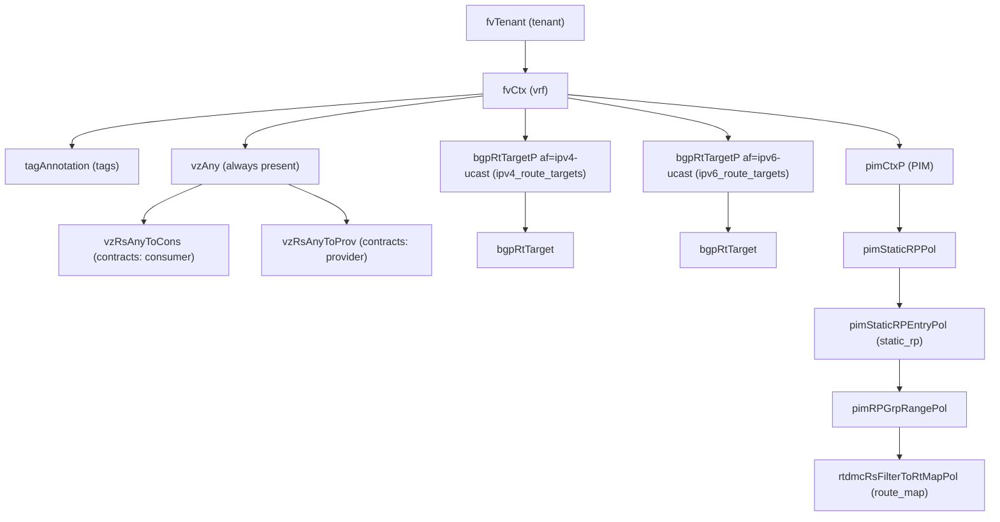

# VRF

**Task file:** `roles/tenant/tasks/vrf.yml`
**Templates:** `roles/tenant/templates/vrf.json.j2`, `vrf_static_rp.json.j2`
**ACI MIT class:** `fvCtx`

## Description

A VRF (private network / context) provides Layer 3 isolation within a tenant. It
always carries a `vzAny` child (used for VRF-wide contract consumption/provision),
and can optionally carry route-target lists and PIM (multicast) configuration
including static rendezvous points.

## Object Relationships



## Attributes

Root object: `fvCtx`

| Attribute | ACI Attribute | Required | Expected Value | Default |
|---|---|---|---|---|
| `name` | `name` | Yes | string | — |
| `description` | `descr` | No | string | `''` |
| `state` | `status` | No | `present` \| `absent` | `present` (see caveat below) |
| `enforcement` | `pcEnfPref` | No | `enforced` \| `unenforced` | `enforced` |
| `preferred_group` | child `vzAny.prefGrMemb` | No | `enabled` \| `disabled` | `disabled` |
| `tags` | see [Tags](#tags) | No | array | `[]` |
| `contracts` | see [Contracts](#contracts) | No | array | `[]` |
| `ipv4_route_targets` | see [Route Targets](#route-targets) | No | array | `[]` |
| `ipv6_route_targets` | see [Route Targets](#route-targets) | No | array | `[]` |
| `PIM` | see [PIM](#pim) | No | object | (omitted if unset) |

> **`state` default caveat:** `present` is only the default *if the task actually
> runs*. `roles/tenant/tasks/vrf.yml` gates on `vrf | has_nested_state`, which
> is `True` only when a `state` key exists *somewhere* in the VRF's tree — on
> the VRF itself, or on any tag, contract, route target, or PIM/static-RP
> entry. A VRF with no `state` key anywhere is skipped entirely: not created,
> updated, or touched — it is not an implicit "create with defaults." For
> example, a VRF with no `vrf.state` but with a contract carrying
> `state: absent` still runs (the VRF itself defaults to `present` while that
> contract is removed); a VRF with no `state` anywhere never executes.

### Tags

Child object: `tagAnnotation`

| Attribute | ACI Attribute | Required | Expected Value | Default |
|---|---|---|---|---|
| `name` | `key` | Yes | string | — |
| `value` | `value` | Yes | string | — |
| `state` | `status` | No | `present` \| `absent` | `present` |

### Contracts

Child object: `vzRsAnyToCons` (consumer) / `vzRsAnyToProv` (provider), under the
always-present `vzAny`

| Attribute | ACI Attribute | Required | Expected Value | Default |
|---|---|---|---|---|
| `name` | `tnVzBrCPName` | Yes | string | — |
| `type` | selects `vzRsAnyToCons` vs `vzRsAnyToProv` (not a literal attribute) | Yes | `provider` \| `consumer` | — |
| `state` | `status` | No | `present` \| `absent` | `present` |

### Route Targets

Child object: `bgpRtTarget`, under a `bgpRtTargetP` (`af=ipv4-ucast` for
`ipv4_route_targets`, a second one with `af=ipv6-ucast` for `ipv6_route_targets`)

| Attribute | ACI Attribute | Required | Expected Value | Default |
|---|---|---|---|---|
| `name` | `rt` | Yes | string | — |
| `type` | `type` | Yes | `import` \| `export` | — |
| `state` | `status` | No | `present` \| `absent` | `present` |

### PIM

Child object: `pimCtxP`

| Attribute | ACI Attribute | Required | Expected Value | Default |
|---|---|---|---|---|
| `mtu` | `mtu` | No | integer | `1500` |
| `fast-convergence` | folded into `ctrl` (`fast-conv`) | No | boolean | `false` |
| `strict-RFC-compliant` | folded into `ctrl` (`strict-rfc-compliant`) | No | boolean | `false` |
| `state` | `status` | No | `present` \| `absent` | `present` |
| `static_rp` | see [PIM Static RP](#pim-static-rp) | No | array | `[]` |

### PIM Static RP

Child object: `pimStaticRPEntryPol`, under `pimCtxP > pimStaticRPPol`

| Attribute | ACI Attribute | Required | Expected Value | Default |
|---|---|---|---|---|
| `ip` | `rpIp` | Yes | string | — |
| `state` | `status` | No | `present` \| `absent` | `present` |
| `route_map` | grandchild `rtdmcRsFilterToRtMapPol.tDn` (under a `pimRPGrpRangePol`) | No | string, or `{name, tenant}` | (no route-map binding if unset) |

## Examples

### Create a new VRF

```yaml
tenants:
  - name: tenant1
    vrfs:
      - name: vrf1
        enforcement: enforced
        state: present
        contracts:
          - name: shared-services
            type: consumer
        ipv4_route_targets:
          - name: "route-target:ipv4-nn2:65000:100"
            type: export
        PIM:
          mtu: 9000
          static_rp:
            - ip: 10.0.0.5/32
              route_map:
                name: rp-filter
                tenant: tenant1
```

### Add a `vzAny` contract to an existing VRF

```yaml
tenants:
  - name: tenant1
    vrfs:
      - name: vrf1
        contracts:
          - name: shared-services
            type: consumer
            state: present
```

The new contract binding's `state: present` is what makes `has_nested_state`
fire this task — `vrf.state` is left unset here since it isn't changing.

### Remove a `vzAny` contract from an existing VRF

```yaml
tenants:
  - name: tenant1
    vrfs:
      - name: vrf1
        contracts:
          - name: shared-services
            state: absent
```

### Delete a VRF entirely

```yaml
tenants:
  - name: tenant1
    vrfs:
      - name: vrf1
        state: absent
```
